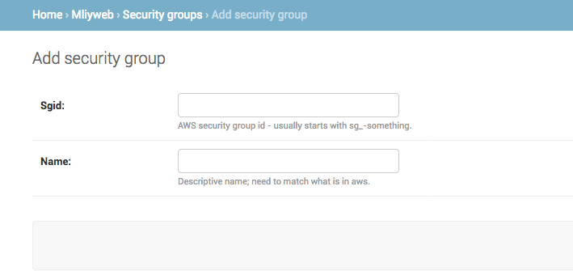

# MLiy Open Source Administrator Guide

## Pre-requisites
- Knowledge of how to launch EC2, CloudFormation, ELB and RDS resources in AWS
- AWS Account with subnets in a VPC
- Four security groups: One for ELB, one for MLiy Web Application, one for MLiy instances and one for MySQL RDS
  1.	MLiy-elb (if using ELB): Inbound on HTTPS port 443 from allowed networks and MLiy-ec2 and Outbound to HTTPS port 443 on MLiy-web.
  2. MLiy-web: Inbound on SSH 22 from allowed networks and on HTTPS port 443 from MLiy-elb (if ELB) or MLiy-ec2 (if no ELB),and Outbound to MySQL port 3306 on MLiy-db, LDAPS port 636 to LDAP server, DNS REST API port on 443 to DNS Registration service (optional)
  3. MLiy-ec2: Inbound SSH port 22 and HTTPS port 443 from allowed networks and Outbound to MLiy-elb (if ELB) or MLiy-ec2 (if no ELB) on HTTPS port 443, to the Internet directly or via proxy or to any other internal network and data services.
  4. MLiy-rds: Inbound to MySQL port 3306 from MLiy-web
- A location in S3 bucket to store the MLiy package
- An IAM role to use create and manage the following resources: CloudFormation, EC2, EBS, Auto Scaling Launch Configuration and Auto Scaling Group, Elastic Load Balancer and RDS DBInstance.
- An IAM instance profile for MLiy EC2 instance with ability to manage EC2, EBS, Cloudformation Stack and  read access to the S3 bucket containing the MLiy package and pass role permission to IAM role for MLiy
- An IAM instance profile for MLiy with encrypt/decrypt access to KMS keys and read/write access to S3 buckets
- SSL Certificate for MLiy website and wildcard certificate for application domain.
- Active Directory (AD) listening on LDAPS. OpenLDAP with memberOf overlay is supported (see section 'Support for OpenLDAP') .
- An LDAP account to be configured as a service account in order to verify group authorization


## Build
Checkout the MLiy project from Git.

Change directory to the scripts folder  and run the following command to build:
```
cd scripts
bash build.sh
```
MLiy package odapweb.tar.gz is generated in the ./dist folder. Stage the ./dist/odapweb.tar.gz file in an S3 location.

## Install

### MLiy Web Application

The CloudFormation Stack will launch an EC2 instance via Auto Scaling Launch Configuration and Group and optionally create and ELB with multi-AZ support. Use AWS Console or CLI to invoke the CloudFormation template ./scripts/AWS_APP_MLiy_CloudFormation.json specifying the parameters appropriate for your environment.

- ImageId: The AMI (Amazon Machine Image) to use.
- KeyName: The SSH key pair to use.
- IamInstanceProfile: The instance profile to use.
- SecurityGroups: Security Groups to associate with Launch Configuration
- SourceBucket: The source S3 bucket where the installation script is located. Do not prefix with s3://.
- asVpcSubnets: The subnet(s) to use for the autoscaling group.
- OdapMgrHostname: The Fully Qualified Hostname of MLiy Web Application application.
- DjangoSecretKey: The secret key for a particular Django installation. This is used to provide cryptographic signing, and should be set to a unique, unpredictable value.
- LdapAuthUrl: Specifies the LDAP server, the base DN, the attribute to use in the search, as well as the extra search filter to use in the format ldaps://Your_LDAP_FQDN:636/User_DN?sAMAccountName?sub?(objectClass=*)
- LdapBindDn: A DN to bind with during the search phase.
- LdapBindPassword: A password to bind with during the search phase.
- LdapGroupAttribute: Authorize member of this group to access.

You can gather the above values and fill out values in the script template scripts/config.sh. Use an IAM user or role with permission to launch CloudFormation Stack, EC2 instances, AutoScaling Launch Configuration and AutoScaling Groups to launch the scripts/deployment.sh script (which calls the config.sh script you just updated):

```
cd scripts
bash ./deployment.sh
```

MLiy deployment script creates Django models in the included sqllite3 database. You will want to use a separate MySQL database for production deployments.

### MySQL RDS

Similarly, use the CloudFormation template ./scripts/AWS_RDS_MLiy_CloudFormation.json to create a MySQL database.

- DBName: The database name.
- MasterUsername: The database admin account username.
- MasterUserPassword: The database admin account password
- VPCSecurityGroups: The list of VPC security groups that contains instances that need access to the database
- DBSubnetGroupName: A DB subnet group to associate with the DB instance.
- KmsKeyId: The ARN of the AWS Key Management Service (AWS KMS) master key that's used to encrypt the DB instance.
- DBParameterGroupName: The name of an existing DB parameter group.
- OptionGroupName: The option group that this DB instance is associated with.

## Post Installation Tasks

### Setup MySQL RDS Connection

1. On the MLiy web application server, replace information for sqlite3 with MySQL in the Databases section of ~odapapp/odapweb/odapweb/settings.py file as user odapapp:
```
DATABASES = {
    'default': {
        'ENGINE': 'django.db.backends.mysql',
        'NAME' : 'your_database_name',
        'HOST' : 'your_rds_identifier.your_region.rds.amazonaws.com',
        'USER' : 'user_id_to_use_to_connect_to_mysql_db',
        'PASSWORD' : 'password_for_the_user_id',
        'OPTIONS' : {
                'charset' : 'utf8',
                'ssl': {'ca': '/etc/aws-rds/ssl/rds-combined-ca-bundle.pem'},
        }
    }
}
```
2. Go to the ~odapapp/odapweb folder and run the following commands to create the models in your MySQL RDS:
```
source ../odap-python/bin/activate
python manage.py makemigrations
python manage.py migrate
python manage.py sync_cf
```
3. Restart apache as root:
```
apachectl stop
apachectl start
```

### Create an admin user
Logon to MLiy instance using the SSH Key-pair and sudo to odapapp user and change to odapweb directory:
```
sudo su – odapapp
cd odapweb
```
Activate the Python virtual environment:
```
source ../odap-python/bin/activate
```
Run the following command to create an admin user:
```
python manage.py createsuperuser
```
You will be prompted to enter a username, email address and associated password. Please keep the credentials in a safe location.

You should now be able to open the MLiy website in a browser, click on “Log in to My Dashboard” on the top right corner, and logon with administrative credentials.

### Create a manager group
You will need to create a manager group to assign users to. The manager group is defined in the settings file. If you use the simpledb ficture provided with the website and the default settings file the group is created automatically, named manager. Otherwise you will need to create a group with a matching name in the admin view.

## Initial Setup and Ongoing Maintenance
Before you are able to launch and start using MLiy instances, you will need to create and register (see pre-requisites) some AWS resources.  Logon to MLiy Admin console using the URL https://dns_entry_for_odap_with_ssl_cert/admin. You will see a screen similar to the following:


Click on the Home link on the top left corner and click on Security Groups and add one or more valid security groups in the VPC, including MLiy-ec2 created earlier in pre-requisites.



Click on the Home link on the top left corner and click on Instance Types and add one or more valid EC2 instance types (Look at allowed values for instance types in scripts/ec2/AWS_EC2_MLiy_CloudFormation).


Click on the Home link on the top left corner and click on Groups and add one or more groups.


If MLiy is configured to use an LDAP/Active Directory server, a user will be added automatically the first time the user logs on. If MLiy is configured to use the local database for authentication, click on the Home link on the top left corner and click on Users and add one or more users. If you are prompted to enter a password when saving, use "No password set." This field is not used.


Click on the Home link on the top left corner and click on Group Configs and add one or more group configuration. Select the group created earlier from the drop down box and give the group configuration a name (usually the same as the group name). Is a user is a member of the specified AD group, the user will automatically provisioned to this group and group configuration. Select any instance types to exclude, default security groups to use (in order to limit access to data and services) and optional security groups.


In order to identify EC2 instances launched by this group, provide an instance name.  Provide project name code and charge code and software development tags for AWS resources. Associate SSH keypair and IAM instance profile with this group configuration.


Click on the Home link on the top left corner and click on Software Configs and add one or more software configuration. Give the software configuration a name. Specify the shell script to run during instance provisioning and associated AWS Cloudformation template to call from the drop downs. Add or select parameters to replace tokens with your actual values in the shell script. Specify the AMI ID to launch the EC2 instance with. Select the compatible EC2 instance types for this software configuration.


Associate the groups/group configurations permitted to use this software configuration.  Specify the default instance name launched with this software configuration if none provided in the group configuration. Describe the software configuration in HTML format; users will see text when launching this software configuration.


Specify the KMS key to encrypt the EBS volume, the device path the volume to be made available to the instance, the default size of the volume.


## Configuring MLiy Image

MLiy web application package includes a sample MLiy EC2 image in scripts/ec2 folder: bootstrap script userdata_MLiy.sh and the associated AWS Cloudformation template AWS_EC2_MLiy_CloudFormation.json.  If you extend and add your own bootstrap scripts and Cloudformation templates here, and build and deploy, you will be able to select them from the dropdown in the Software Configuration of MLiy Administrative Interface. You will notice tokens ({{{TEXT}}}) in the following bootstrap script. You can add parameters in Software Configuration or Parameters to search and replace these tokens with appropriate values and set the environment variables to pass on to MLiy image. For example, add a parameter to replace token SOURCE_BUCKET with actual value of the bucket name.

```
# BEGIN Mandatory Settings
# Package Location, Name and Installation Script
export SOURCE_BUCKET='{{{SOURCE_BUCKET}}}'
export SOURCE_SCRIPT='{{{SOURCE_SCRIPT}}}'
export SOURCE_PACKAGE='{{{SOURCE_PACKAGE}}}'
# EBS Volume Device Name
export EBS_DEVICE='{{{EBS_DEVICE}}}'
# Set Time Zone see https://en.wikipedia.org/wiki/List_of_tz_database_time_zones
export TIME_ZONE='{{{TIME_ZONE}}}'
# END Mandatory Settings

# BEGIN Custom Settings
# The DNS resolvable fully qualified hostname for MLiy Website
export ODAPMGR_HOSTNAME='{{{ODAPMGR_HOSTNAME}}}'

# Custom R and Python Repository URLs
export CRAN_REPO='{{{CRAN_REPO}}}'
export PyPi_REPO='{{{PyPi_REPO}}}'

# LDAP Settings
export LDAP_TYPE='{{{LDAP_TYPE}}}' # Possible Values: AD or openLDAP
export LDAP_HOST_NAME='{{{LDAP_HOST_NAME}}}'
export LDAP_USER_ID='{{{LDAP_USER_ID}}}'
# Command to execute in order to obtain password for LDAP_USER_ID. This could be opensource credstash, AWS secret manager or just simple echo password
export LDAP_USER_PASSWD_CMD='{{{LDAP_USER_PASSWD_CMD}}}'
export LDAP_USER_BIND_DN="{{{LDAP_USER_BIND_DN}}}"
export LDAP_BASE_DN='{{{LDAP_BASE_DN}}}'
export LDAP_AUTHZ_GROUP="{{{LDAP_AUTHZ_GROUP}}}"
# Wildcard Certificates
export WILDCARD_PUBLIC_CERT='{{{WILDCARD_PUBLIC_CERT}}}'
export WILDCARD_PRIVATE_CERT='{{{WILDCARD_PRIVATE_CERT}}}'
export WILDCARD_CERTS_ARCHIVE='{{{WILDCARD_CERTS_ARCHIVE}}}'
# Custom Root Cert to add to Linux trust store and Java Key Store
export CUSTOM_ROOT_CERTS='{{{CUSTOM_ROOT_CERTS}}}'

# END Custom Settings

cd ~
mkdir MLiy
cd MLiy
aws s3 cp s3://$SOURCE_BUCKET/$SOURCE_PACKAGE .
tar xzf $SOURCE_PACKAGE scripts/proxy.sh scripts/ec2/MLiy
rm -rf $SOURCE_PACKAGE
cd scripts/ec2/MLiy
export SCRIPT_DIR=$(pwd)
bash $SOURCE_SCRIPT
```


## Administrator commands

The MLiy website comes with several administrative commands that can be ran from the server instance. These commands implement the django admin command interface. The documentation for these commands can be found here:

[https://docs.djangoproject.com/en/2.0/ref/django-admin/]

#### Invoking using command line

The commands can be invoked using the command line on the instance. This can be done using a crontab, bash script or by directly running the command from the terminal.

To call the command you need to be in the proper python environment. MLiy comes with a virtual environment installed that is already provisioned with all the necessary libraries. This can  be accessed by calling:

```
source ~/odap-python/bin/activate

cd ~/odap-web

./manage.py 'command name'
```

#### Invoking using python

The commands can also be called inside python code, for example using the plugin system or when editing the source code. They can be called like so:

```
from django.core.management import call_command

call_command('command name')
```

### Refresh Models

This command will start an update thread to sync the database internal to the website with the actual state of instances in AWS. This thread will also be launched by the website, but in a low volume of traffic context it might make sense to run the thread on a schedule. Another use case is running the update thread early morning or after a weekend to make sure the website is prepared for the first user.

The command can be invoked with

```
./manage.py refresh
```

### Sync Cloudformation

This command takes the cloudformation templates and user data scripts from the internal file system and on the s3 location. The file system and s3 locations are located in the settings.py file. They can be set to any location where you will have the cloudformation and user data scripts.

```
DIRECTORY_FILE_LOCATION="scripts/ec2"

S3_FILE_LOCATION=""
```

The command will take the files on s3 and push them to the local repository. It will then populate the internal database with the cloudformation and user data such that you can choose them from a list within software configurations. It can be called with:

```
./manage.py sync_cf
```

Every time you add new bootstrap scripts or edit existing ones, you will have to run the above command to update the database,

### Load data

This is not a management command, but can be very useful when setting up the website initially. There are two fixtures provided with the site, which can be loaded as per this documentation:

[https://docs.djangoproject.com/en/2.0/ref/django-admin/#django-admin-loaddata]

```
./manage.py loaddata simpledb
```

Loads the database with sample information. This will have to be configured later but gives a starting point to work with. This will only work with at least one user and group already in the website (Probably the website superuser and a test group)

```
./manage.py loaddata instances
```

Loads the database with Amazon instance types. No prerequisites necessary.

# Support for OpenLDAP
Please note that text in two brackets [[your_input]] expects you to provide appropriate value.

## Setup OpenLDAP Server
### Installation and Configuration
You can skip this section if you already have OpenLDAP server in place.
In Amazon Linux, as root, run the following yum command to install openLDAP:
```
[root]# yum -y install openldap openldap-servers openldap-clients openldap-devel
```
Generate a password hash to be used as the admin password.
```
[root]#slappasswd
New password:[[Your_Password]]
Re-enter new password:[[Your_Password]]
{SSHA}Vq2iFfggZoiBUnQFIjEE4npeJLdzuJZC
```

Add the admin user and the admin user's password hash to the OpenLDAP configuration in the olcDatabase={2}bdb.ldif file. If the olcRootPW attribute does not already exist, create it. Then set the value to be the hash you created from slappasswd. Also update the olcSuffix to match your DNS domain name.
```
[root]# cd /etc/openldap/slapd.d/cn\=config
```

`vi olcDatabase\=\{2\}bdb.ldif`:
```
olcSuffix: dc=example,dc=com
...
olcRootDN: cn=Manager,dc=example,dc=com
...
olcRootPW: {SSHA}Vq2iFfggZoiBUnQFIjEE4npeJLdzuJZC
...
```
Modify the DN of the admin user in the olcDatabase={1}monitor.ldif file to match the olcRootDN line in the olcDatabase={2}bdb.ldif file.

`vi olcDatabase\=\{1\}monitor.ldif`:
```
olcAccess: {0}to *  by dn.base="gidNumber=0+uidNumber=0,cn=peercred,cn=external,cn=auth" read  by dn.base="cn=manager,dc=example,dc=com" read  by * none
```
Add the following two lines to the end of the file to restrict users from viewing other users' password hashes.

`vi olcDatabase\=\{2\}bdb.ldif`:
```
olcAccess: {0}to attrs=userPassword by self write by dn.base="cn=Manager,dc=example,dc=com" write by anonymous auth by * none
olcAccess: {1}to * by dn.base="cn=Manager,dc=example,dc=com" write by self write by * read
```
Configure openLDAP for automatic restart on system startup and startup openLDAP.
```
[root]# chkconfig slapd on
[root]# service slapd start
```
Add the entries for domain and Organizational Unit (OU), users and groups.
```
[root]# cd
[root]# cat > example.ldif <<EOF

dn: dc=example,dc=com
objectClass: dcObject
objectClass: organization
dc: example
o : example

dn: ou=users,dc=example,dc=com
objectClass: organizationalUnit
ou: users

dn: ou=groups,dc=example,dc=com
objectClass: organizationalUnit
ou: groups

EOF

[root]# ldapadd -f example.ldif -D cn=Manager,dc=example,dc=com -w [[Your_Password]]
```
Verify that the entries were added correctly.
```
[root]# ldapsearch -x -LLL -b dc=example,dc=com

dn: dc=example,dc=com
objectClass: dcObject
objectClass: organization
dc: example
o: example

dn: ou=groups,dc=example,dc=com
objectClass: organizationalUnit
ou: Groups

dn: ou=users,dc=example,dc=com
objectClass: organizationalUnit
ou: users
```

### Enable memberOf Overlay
Both the MLiy web application and the MLiy image uses the memberOf attribute of a user to verify during authentication whether the user is member of an authorized group. Every group created before memberOf overlay is enabled has to be deleted and recreated in order for these changes to take effect. LDAP assigns a "member" attribute behind the scenes to existing users when creating a group. For existing openLDAP implementation, we recommend creating new groups for MLiy users.

You need to find out what backend databases you have configured. The one you're looking for could be BDB, HDB or MDB. In our case, it is BDB below.
```
[root]# ldapsearch -H ldapi:/// -Y EXTERNAL -b "cn=config" -LLL -Q "olcDatabase=*" dn

dn: olcDatabase={-1}frontend,cn=config

dn: olcDatabase={0}config,cn=config

dn: olcDatabase={1}monitor,cn=config

dn: olcDatabase={2}bdb,cn=config

dn: olcOverlay={0}memberof,olcDatabase={2}bdb,cn=config

dn: olcOverlay={1}refint,olcDatabase={2}bdb,cn=config
```

Set up the memberOf module and configuring referential integrity:
```
[root]# cat >  memberOfmodule.ldif <<EOF

dn: cn=module{0},cn=config
changetype: modify
add: olcModuleLoad
olcModuleLoad: memberof.la

EOF

[root]# ldapadd -Q -Y EXTERNAL -H ldapi:/// -f memberOfmodule.ldif

[root]# cat > memberof_config.ldif <<EOF

dn: olcOverlay=memberof,olcDatabase={2}bdb,cn=config
changetype: add
objectClass: olcConfig
objectClass: olcMemberOf
objectClass: olcOverlayConfig
objectClass: top
olcOverlay: memberof
olcMemberOfDangling: ignore
olcMemberOfRefInt: TRUE
olcMemberOfGroupOC: groupOfNames
olcMemberOfMemberAD: member
olcMemberOfMemberOfAD: memberOf

EOF

[root]# ldapadd -Q -Y EXTERNAL -H ldapi:/// -f memberOfconfig.ldif
```
Load and configure the refint module:
```
[root]# cat > refintmod.ldif <<EOF

dn: cn=module{0},cn=config
add: olcmoduleload
olcmoduleload: refint

EOF

[root]# ldapmodify -Q -Y EXTERNAL -H ldapi:/// -f refintmod.ldif

[root]# cat > refintconfig.ldif <<EOF

dn: olcOverlay=refint,olcDatabase={2}bdb,cn=config
objectClass: olcConfig
objectClass: olcOverlayConfig
objectClass: olcRefintConfig
objectClass: top
olcOverlay: refint
olcRefintAttribute: memberof member manager owner

EOF

ldapadd -Q -Y EXTERNAL -H ldapi:/// -f refintconfig.ldif
```

### Setup Sample Users and Groups
Use the following command to generate hash for each user's password:
```
[root]# slappasswd -h {SHA} -s [[Your_Password]]
{SSHA}Vq2iFfggZoiBUnQFIjEE4npeJLdzuJZC
```

Create the service or application account. The account will used to query LDAP during authentication.
```
[root]# cd
[root]# cat > service_user.ldif<<EOF

dn: cn=Service User,ou=Users,dc=example,dc=com
objectClass: top
objectClass: posixAccount
objectClass: shadowAccount
objectClass: inetOrgPerson
objectClass: organizationalPerson
objectClass: person
cn: Service User
givenName: Service
sn: User
uid: svcuser
uidNumber: 1000
gidNumber: 100
homeDirectory: /home/svcuser
mail: svcuser@[[Your_Domain]]
loginShell: /bin/bash
userPassword: {SSHA}Vq2iFfggZoiBUnQFIjEE4npeJLdzuJZC

EOF

[root]# ldapadd -f service_user.ldif -D cn=Manager,dc=example,dc=com -w [[Your_Password]]
```

Create a sample MLiy user to test access and usage with.
```
[root]# cat > mliy_user.ldif<<EOF

dn: cn=Mliy User,ou=Users,dc=example,dc=com
objectClass: top
objectClass: posixAccount
objectClass: shadowAccount
objectClass: inetOrgPerson
objectClass: organizationalPerson
objectClass: person
cn: Mliy User
givenName: Mliy
sn: User
uid: mliyuser
uidNumber: 1001
gidNumber:101
homeDirectory: /home/mliyuser
mail: mliyuser@[[Your_Domain]]
loginShell: /bin/bash
userPassword: {SSHA}Vq2iFfggZoiBUnQFIjEE4npeJLdzuJZC

EOF

[root]# ldapadd -f mliy_user.ldif -D cn=Manager,dc=example,dc=com -w [[Your_Password]]
```

Create another user to test no access to MLiy.
```
[root]# cat > test_user.ldif<<EOF

dn: cn=Test User,ou=Users,dc=example,dc=com
objectClass: top
objectClass: posixAccount
objectClass: shadowAccount
objectClass: inetOrgPerson
objectClass: organizationalPerson
objectClass: person
cn: Test User
givenName: Test
sn: User
uid: testuser
uidNumber: 1002
gidNumber:101
homeDirectory: /home/testuser
mail: testuser@[[Your_Domain]]
loginShell: /bin/bash
userPassword: {SSHA}Vq2iFfggZoiBUnQFIjEE4npeJLdzuJZC

EOF

[root]# ldapadd -f test_user.ldif -D cn=Manager,dc=example,dc=com -w [[Your_Password]]
```

Create a group for users authorized to access MLiy:
```
[root]# cat > mliygroup.ldif<<EOF

dn: cn=mliyusers,ou=Groups,dc=example,dc=com
objectClass: groupofnames
cn: mliyusers
description: All MLiy users
member: cn=Mliy User,ou=Users,dc=example,dc=com

EOF

[root]# ldapadd -f mliygroup.ldif -D cn=Manager,dc=example,dc=com -w [[Your_Password]]
```

Verify that users is a member of the MLiy user's group:
```
[root]# ldapsearch -x -LLL -H ldap:/// -b "cn=Mliy User,ou=Users,dc=example,dc=com" dn memberof
dn: cn=Mliy User,ou=users,dc=example,dc=com
memberOf: cn=mliyusers,ou=Groups,dc=example,dc=com
```

### Enable SSL
Copy your signed public SSL cert and private key and cert store to /etc/openldap/certs/ and change the owner to user ldap:
```
[root]# cp [[Your_Public_Signed_Cert]].crt /etc/openldap/certs/
[root]# cp [[{]]Your_Private_key]].key /etc/openldap/certs/
[root]# cp /etc/pki/tls/certs/ca-bundle.crt /etc/openldap/certs/

[root]# chown ldap. /etc/openldap/certs/{Your_Private_key}.key /etc/openldap/certs/[[Your_Public_Signed_Cert]].crt /etc/openldap/certs/ca-bundle.crt
```
Create and execute the following config:
```
[root]# cat > mod_ssl.ldif <<EOF

dn: cn=config
changetype: modify
add: olcTLSCACertificateFile
olcTLSCACertificateFile: /etc/openldap/certs/ca-bundle.crt
-
replace: olcTLSCertificateFile
olcTLSCertificateFile: /etc/openldap/certs/{Your_Public_Signed_Cert}.crt
-
replace: olcTLSCertificateKeyFile
olcTLSCertificateKeyFile: /etc/openldap/certs/[[Your_Private_key]].key
EOF

[root]# ldapmodify -Y EXTERNAL -H ldapi:/// -f mod_ssl.ldif

SASL/EXTERNAL authentication started
SASL username: gidNumber=0+uidNumber=0,cn=peercred,cn=external,cn=auth
SASL SSF: 0
modifying entry "cn=config"
```

Change the LDAP configuration to use LDAPS:
```
[root]# vi /etc/sysconfig/ldap:

SLAPD_LDAPS=yes

[root]# service slapd restart

Stopping slapd:                    [  OK  ]
Starting slapd:                    [  OK  ]
```

If using Self-signed cert, make the following change in LDAP clients:
```
echo "TLS_REQCERT allow" >> /etc/openldap/ldap.conf
```

Finally, test LDAPS:
```
ldapsearch -v -x -LLL -b dc=example,dc=com -ZZ
ldapsearch -v -x -LLL -H ldaps://localhost -b dc=example,dc=com
```

## MLiy Web application and openLDAP
The value of AuthLDAPURL will be similar to ldaps://*Your_LDAP_HOST_NAME*/ou=Users,*Your_Domain*?uid,cn,sn,givenName,mail
See http://httpd.apache.org/docs/current/mod/mod_authnz_ldap.html on how to make your LDAP server work with MLiy Web application. Here is sample configuration that works with the sample OpenLDAP setup provided here:

`/etc/httpd/conf.d/odapweb.conf`:
```
<Location />
  AuthType Basic
  AuthBasicProvider ldap
  AuthName "LDAP Authentication"
  AuthLDAPURL "ldaps://[[Your_LDAP_HOST_NAME]]/ou=Users,dc=example,dc=com?uid,cn,sn,givenName,mail"
  AuthLDAPBindDN "cn=Service User,ou=Users,dc=example,dc=com"
  AuthLDAPBindPassword "[[Your_password]]"
  AuthLDAPGroupAttribute member
  Require ldap-attribute memberOf="cn=mliyusers,ou=Groups,dc=example,dc=com"
</Location>
```

If your LDAP server does not have valid SSL certificate, you may temporarily disable certificate verification by uncommenting #LDAPVerifyServerCert Off in /etc/httpd/conf.d/odapweb.conf or in source scripts/install.sh, build, stage and deploy. We highly recommended that you use valid SSL certificates.

## MLiy Image and openLDAP
In Admin interface of MLiy application, create a parameter key LDAP_TYPE with value openLDAP. Use this parameter in Software Configuration of this MLiy image. See https://arthurdejong.org/nss-pam-ldapd/docs on how to make nss-pam-ldapd package work with your LDAP server. Here is sample configuration that works with the sample OpenLDAP setup provided here:

`/etc/nslcd.conf`:
```
uid nslcd
gid nslcd
ldap_version 3
uri ldaps://[[Your_LDAP_HOST_NAME]]/
ignorecase yes
base dc=example,dc=com
binddn cn=Service User,ou=Users,dc=example,dc=com
bindpw [[Your_password]]
ssl no
tls_reqcert hard
tls_cacertfile /etc/ssl/certs/ca-bundle.crt
pagesize 1000
bind_timelimit 30
timelimit 30
scope sub
referrals no

filter passwd (&(objectClass=person)(memberOf=cn=mliyusers,ou=Groups,dc=example,dc=com))
map    passwd gecos            displayName
map    passwd loginShell       "/bin/bash"
map    passwd homeDirectory    "/ext/home/analyst"
map    passwd gidNumber        "10001"
filter shadow (&(objectClass=person)(memberOf=cn=mliyusers,ou=Groups,dc=example,dc=com))
filter group  (objectClass=groupOfNames)
```

`/etc/pam_ldap.conf`:
```
ldap_version 3
uri ldaps://[[Your_LDAP_HOST_NAME]]/
base dc=example,dc=com
binddn cn=Service User,ou=Users,dc=example,dc=com
bindpw [[Your_password]]
ssl no
tls_reqcert hard
tls_cacertfile /etc/ssl/certs/ca-bundle.crt
bind_timelimit 30
scope sub
referrals no
pam_login_attribute uid
pam_filter objectClass=person
```

If your LDAP server does not have valid SSL certificate, you may temporarily disable certificate verification by changing "tls_reqcert hard" to "tls_reqcert allow" in either the instance ( update /etc/nslcd.conf and /etc/pam_ldap.conf and restart nslcd) or change source scripts/ec2/MLiy/setup_ldap.sh, build, stage and deploy. We highly recommended that you use valid SSL certificates.

#Django Administrator documentation

Additional information about administrering the django site, including the user auth module can be found at 

https://docs.djangoproject.com/en/2.1/ref/contrib/admin/

and on the MLiy site at the relative url

/admin/docs
