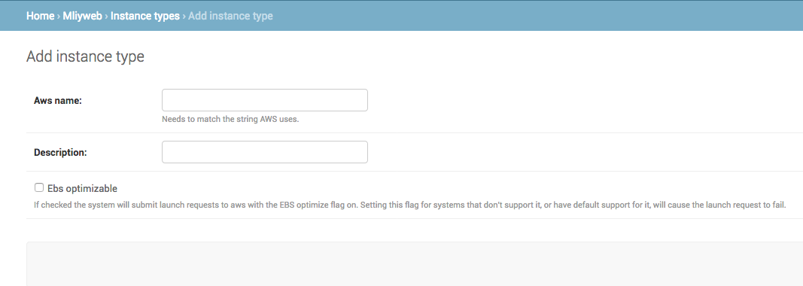
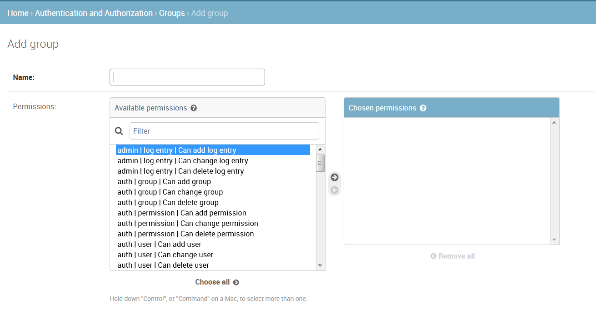
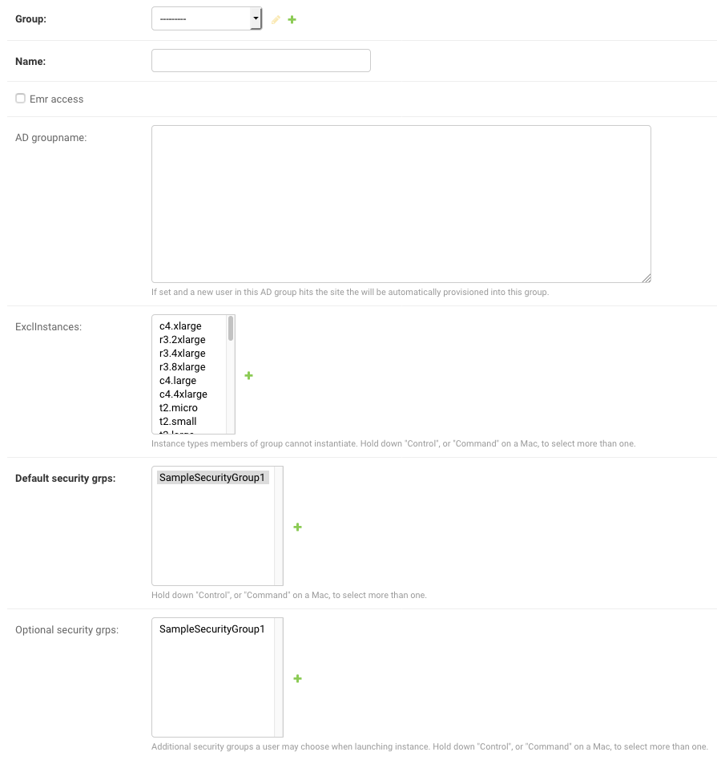
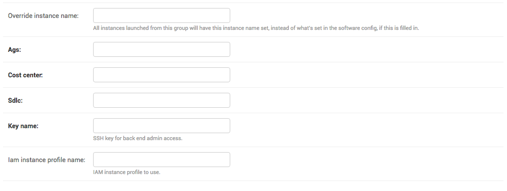
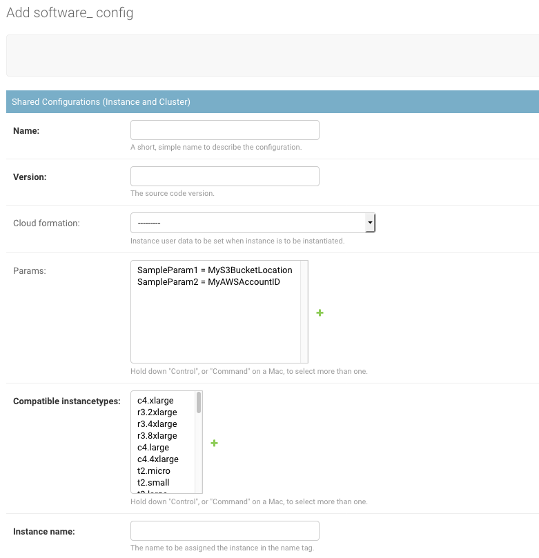
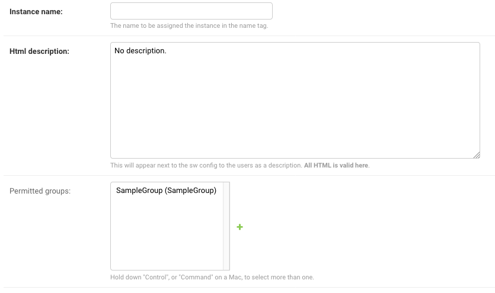

# MLiy Open Source Administrator Guide

[Pre-requisites](#prerequisites)

[Build](#build)

[Install](#install)
- [MLiy Web Application](#mliy-web-application)
- [MySQL RDS](#mysql-rds)

[Post Installation Tasks](#post-installation-tasks)
- [Setup MySQL RDS Connection](#setup-mysql-rds-connection)
- [Create an Admin User](#create-an-admin-user)
- [Create a Manager Group](#create-a-manager-group)

[Initial Setup and Ongoing maintenance](#initial-setup-and-ongoing-maintenance)

[Configuring MLiy Image](#configuring-mliy-image)

[Administrator Commands](#administrator-commands)
- [Refresh Models](#refresh-models)
- [Sync Cloudformation](#sync-cloudformation)
- [Load Data](#load-data)

[Django Administrator Documentation](#django-administrator-documentation)


## Prerequisites

- AWS Account with subnets in a VPC
- Knowledge of how to launch EC2, CloudFormation, ELB and RDS resources in AWS
- The ability to SSH into the MLiy Web Application's EC2 instance
- A location in S3 bucket to store the MLiy package
- SSL Certificate for MLiy website and wildcard certificate for application domain.
- Active Directory (AD) listening on LDAPS. OpenLDAP with memberOf overlay is supported (see section [Support for OpenLDAP]) .
- An LDAP account to be configured as a service account in order to verify group authorization
- An IAM instance profile for MLiy EC2 instance with ability to manage EC2, EBS, Cloudformation Stack, read access to the S3 bucket containing the MLiy package, and pass role permission to IAM role for MLiy
- An IAM instance profile for MLiy with encrypt/decrypt access to KMS keys and read/write access to S3 buckets
- An IAM role to use create and manage resources. Resources * are optional:
  - CloudFormation
  - EC2
  - EBS
  - Auto Scaling Launch Configuration
  - Auto Scaling Group
  - Elastic Load Balancer*
  - RDS DBInstance
  - Route 53*
- Security Groups

| Security Group | Inbound                               | Outbound                                     |
| ---            | ---                                   | ---                                          |
| MLiy-elb       | HTTPS port 443 from allowed networks  | HTTPS port 443 to MLiy-web                   |
|                | MLiy-ec2                              |                                              |
| MLiy-web       | SSH 22 from allowed networks          | MySQL port 3306 on MLiy-db                   |
|                | MLiy-ec2 (if no ELB)                  | LDAP Server port 636                         |
|                | HTTPS port 443 from MLiy-elb (if ELB) |                                              |
| MLiy-ec2       | SSH port 22 from allowed networks     | MLiy-elb port 443 (if ELB)                   |
|                | HTTPS port 443 from allowed networks  | MLiy-ec2 port 443 (if no ELB)                |
|                |                                       | Other*                                       |
| MLiy-rds       | MySQL port 3306 from MLiy-web         |                                              |
*to the internet, proxy, data services, internal network, etc.


## Build
Checkout the MLiy project from Git.

Change directory to the scripts folder  and run the following command to build:
```
cd scripts
bash build.sh
```
MLiy package mliyweb.tar.gz is generated in the ./dist folder. Stage the ./dist/mliyweb.tar.gz file in an S3 location.
This package will be used for installing the MLiy Web Application and the MLiy Image (in the EC2 instances started from the MLiy Web Application).

## Install

### MLiy Web Application

MLiy is installed through CloudFormation and will launch an EC2 instance via Auto Scaling Group and Launch Configuration.
The Launch Configuration runs its User Script, which are shell commands to install the application in the EC2 instance once it is ready. This should reference the file created in the "Build" step.

Options:

- ELB: If an ELB name is specified, it will create an ELB with multi-AZ support
- Route 53: If the web app's DNS is specified, it will create a Route 53 DNS entry and attach it to the created ELB.
  - The ELB must be created.
  - An existing Hosted zone must be provided.

Parameters can be set in the Cloudformation template "./scripts/AWS_APP_MLiy_CloudFormation.json". To simplify things, a [config.sh] and [deployment.sh] scripts are provided in the ./scripts folder.
- Set the parameters in config.sh
- Deploy to AWS by running deployment.sh.
  + deployment.sh references the config.sh file for parameters.
  + deployment.sh uses AWS CLI to create the Cloudformation stack.
  + Permissions required for the role which runs the AWS CLI in deployment.sh:
    - launch CloudFormation Stack
    - launch EC2 instances
    - launch AutoScaling Launch Configuration
    - launch AutoScaling Groups

`scripts/config.sh`
```
# Enter the appropriate values for your environment
STACK_NAME='Your Stack Name'
SSH_KEY_PAIR='Your SSH Key Pair Name'
EC2_IMAGE_ID='Your Amazon Image ID'
EC2_INSTANCE_TYPE='Your EC2 Instance Type'
EC2_INSTANCE_PROFILE='Your IAM Instance Profile'
EC2_SECURITY_GROUPS='List of security groups separated by comma'
VPC_SUBNETS='List of subnets separated by comma'
MLIY_WEB_APP_FQDN='Fully Qualified Domain Name to reach MLIY Web Application'
DJANGO_SECRET_KEY='Enter random characters'
LDAP_AUTHENTICATION_URL='ldaps://LDAP_SERVER_FQDN:636/OU_to_Search_for_Users?sAMAccountName,givenName,sn,mail,memberOf?sub?(sAMAccountType=805306368)'
LDAP_BIND_USER_DN='User Distinguish Name to use to connect to LDAP Server'
LDAP_BIND_USER_PASSWD="$(Command to run to obtain the password for above user)"
LDAP_GROUP_ATTRIBUTE='Distinguish Name of the Group used for authorization during authentication'
S3_SOURCE_BUCKET='Name of the bucket and prefix contaning source package mliyweb.tar.gz; DO NOT start with s3//;'
TAGS="List of Key, Value pairs to tag reqources with"

# Optional
ELB_NAME='Your elastic Elastic Load Balancer name'
ELB_SUBNETS="Comma separated list of subnets"
ELB_SECURITY_GROUPS="Comma separated list of security groups"
ELB_SSL_CERTIFICATE_ARN="ARN of the SSL certificate on AWS"
ELB_HEALTH_URL="URL for checking the health of the application for Load Balancing"
DNS_SERVICE="DNS service to use for registering the site with a DNS (default aws)"
DOMAIN_NAME="Domain name for the MLiy web app"
APP_DNS="DNS entry for the MLiy web app: mydns -> mydns.my.hosted.zone.com."
HOSTED_ZONE_NAME="Required for Route 53. Hosted zone name for the MLiy web application: my.hosted.zone.com"
```

_Deployment Command_
```
cd scripts
bash ./deployment.sh
```

### MySQL RDS
MLiy deployment script creates Django models in the included sqllite3 database. You will want to use a separate MySQL database for production deployments.

We have provided a CloudFormation template ./scripts/AWS_RDS_MLiy_CloudFormation.json to create a MySQL database.

Cloudformation Parameters:

- DBName: The database name.
- MasterUsername: The database admin account username.
- MasterUserPassword: The database admin account password
- VPCSecurityGroups: The list of VPC security groups that contains instances that need access to the database
- DBSubnetGroupName: A DB subnet group to associate with the DB instance.
- KmsKeyId: The ARN of the AWS Key Management Service (AWS KMS) master key that's used to encrypt the DB instance.
- DBParameterGroupName: The name of an existing DB parameter group.
- OptionGroupName: The option group that this DB instance is associated with.

## Post Installation Tasks
These require the user to SSH into the instance that MLiy resides on.

### Setup MySQL RDS Connection

1. On the MLiy web application server, replace information for sqlite3 with MySQL in the Databases section of ~mliyapp/mliyweb/mliyweb/settings.py file as user mliyapp:
```
DATABASES = {
    'default': {
        'ENGINE': 'django.db.backends.mysql',
        'NAME' : 'your_database_name',
        'HOST' : 'your_rds_identifier.your_region.rds.amazonaws.com',
        'USER' : 'user_id_to_use_to_connect_to_mysql_db',
        'PASSWORD' : 'password_for_the_user_id',
        'OPTIONS' : {
                'charset' : 'utf8',
                'ssl': {'ca': '/etc/aws-rds/ssl/rds-combined-ca-bundle.pem'},
        }
    }
}
```
2. Go to the ~mliyapp/mliyweb folder and run the following commands to create the models in your MySQL RDS:
```
source ../mliy-python/bin/activate
python manage.py makemigrations
python manage.py migrate
python manage.py sync_cf
```
3. Restart apache as root:
```
apachectl stop
apachectl start
```

### Create an Admin User
If LDAP authorization is set up properly and the LDAP plugin is implemented correctly, this step may not be needed. By default, Django provides a login page for the Admin site. However, if the is_staff=True is set in the plugin, this step can be bypassed. Setting is_admin=True also gives users admin status and access to all the features of the Django admin console. See the example plugin in ldapplugin/ldapauth.py

Logon to MLiy instance using the SSH Key-pair and sudo to mliyapp user and change to mliyweb directory:
```
sudo su – mliyapp
cd mliyweb
```
Activate the Python virtual environment:
```
source ../mliy-python/bin/activate
```
Run the following command to create an admin user:
```
python manage.py createsuperuser
```
You will be prompted to enter a username, email address and associated password. Please keep the credentials in a safe location.

You should now be able to open the MLiy website in a browser, click on “Log in to My Dashboard” on the top right corner, and logon with administrative credentials.

### Create a Manager Group
You will need to create a manager group to assign users to. The manager group is defined in the settings file. If you use the simpledb fixture provided with the website and the default settings file the group is created automatically, named manager. Otherwise you will need to create a group with a matching name in the admin view.

## Initial Setup and Ongoing Maintenance
Before you are able to launch and start using MLiy instances, you will need to create and register (see pre-requisites) some AWS resources.  Logon to MLiy Admin console using the URL https://dns_entry_for_mliy_with_ssl_cert/admin. You will see a screen similar to the following:


Click on the Home link on the top left corner and click on Security Groups and add one or more valid security groups in the VPC, including MLiy-ec2 created earlier in pre-requisites.


Click on the Home link on the top left corner and click on Instance Types and add one or more valid EC2 instance types (Look at allowed values for instance types in scripts/ec2/AWS_EC2_MLiy_CloudFormation).



Click on the Home link on the top left corner and click on Groups and add one or more groups.



If MLiy is configured to use an LDAP/Active Directory server, a user will be added automatically the first time the user logs on. If MLiy is configured to use the local database for authentication, click on the Home link on the top left corner and click on Users and add one or more users. If you are prompted to enter a password when saving, use "No password set." This field is not used.


Click on the Home link on the top left corner and click on Group Configs and add one or more group configuration. Select the group created earlier from the drop down box and give the group configuration a name (usually the same as the group name). If a user is a member of the specified AD group, the user will automatically provisioned to this group and group configuration. Select any instance types to exclude, default security groups to use (in order to limit access to data and services) and optional security groups.



In order to identify EC2 instances launched by this group, provide an instance name.  Provide project name code and charge code and software development tags for AWS resources. Associate SSH keypair and IAM instance profile with this group configuration.



Click on the Home link on the top left corner and click on Software Configs and add one or more software configuration. Give the software configuration a name. Specify the shell script to run during instance provisioning and associated AWS Cloudformation template to call from the drop downs. Add or select parameters to replace tokens with your actual values in the shell script. Specify the AMI ID to launch the EC2 instance with. Select the compatible EC2 instance types for this software configuration.



Associate the groups/group configurations permitted to use this software configuration.  Specify the default instance name launched with this software configuration if none is provided in the group configuration. Describe the software configuration in HTML format; users will see text when launching this software configuration.



Specify the KMS key to encrypt the EBS volume, the device path the volume to be made available to the instance, and the default size of the volume.


## Configuring MLiy Image

MLiy web application package includes a sample MLiy EC2 image in scripts/ec2 folder: bootstrap script userdata_MLiy.sh and the associated AWS Cloudformation template AWS_EC2_MLiy_CloudFormation.json. Place custom userdata scripts into this folder and run "python manage.py sync_cf" from inside the EC2 instance (see [Administrator Commands](#administrator-commands)). This will make the script selectable in the Django Admin console > Software Config.

You will notice tokens ({{{TEXT}}}) in the following bootstrap script. You can add parameters in Software Configuration or Parameters to search and replace these tokens with appropriate values and set the environment variables to pass on to MLiy image. For example, add a parameter to replace token SOURCE_BUCKET with actual value of the bucket name.

Set Params:


`userdata_Mliy.sh`
```
# BEGIN Mandatory Settings
# Package Location, Name and Installation Script
export SOURCE_BUCKET='{{{SOURCE_BUCKET}}}'
export SOURCE_SCRIPT='{{{SOURCE_SCRIPT}}}'
export SOURCE_PACKAGE='{{{SOURCE_PACKAGE}}}'
# EBS Volume Device Name
export EBS_DEVICE='{{{EBS_DEVICE}}}'
# Set Time Zone see https://en.wikipedia.org/wiki/List_of_tz_database_time_zones
export TIME_ZONE='{{{TIME_ZONE}}}'
# END Mandatory Settings

# BEGIN Custom Settings
# The DNS resolvable fully qualified hostname for MLiy Website
export MANAGER_HOSTNAME='{{{MANAGER_HOSTNAME}}}'

# Custom R and Python Repository URLs
export CRAN_REPO='{{{CRAN_REPO}}}'
export PyPi_REPO='{{{PyPi_REPO}}}'

# LDAP Settings
export LDAP_TYPE='{{{LDAP_TYPE}}}' # Possible Values: AD or openLDAP
export LDAP_HOST_NAME='{{{LDAP_HOST_NAME}}}'
export LDAP_USER_ID='{{{LDAP_USER_ID}}}'
# Command to execute in order to obtain password for LDAP_USER_ID. This could be opensource credstash, AWS secret manager or just simple echo password
export LDAP_USER_PASSWD_CMD='{{{LDAP_USER_PASSWD_CMD}}}'
export LDAP_USER_BIND_DN="{{{LDAP_USER_BIND_DN}}}"
export LDAP_BASE_DN='{{{LDAP_BASE_DN}}}'
export LDAP_AUTHZ_GROUP="{{{LDAP_AUTHZ_GROUP}}}"
# Wildcard Certificates
export WILDCARD_PUBLIC_CERT='{{{WILDCARD_PUBLIC_CERT}}}'
export WILDCARD_PRIVATE_CERT='{{{WILDCARD_PRIVATE_CERT}}}'
export WILDCARD_CERTS_ARCHIVE='{{{WILDCARD_CERTS_ARCHIVE}}}'
# Custom Root Cert to add to Linux trust store and Java Key Store
export CUSTOM_ROOT_CERTS='{{{CUSTOM_ROOT_CERTS}}}'

# END Custom Settings

cd ~
mkdir MLiy
cd MLiy
aws s3 cp s3://$SOURCE_BUCKET/$SOURCE_PACKAGE .
tar xzf $SOURCE_PACKAGE scripts/proxy.sh scripts/ec2/MLiy
if [[ -f scripts/proxy.sh ]]; then
  export PROXY_SCRIPT="$(pwd)/scripts/proxy.sh"
fi
rm -rf $SOURCE_PACKAGE
cd scripts/ec2/MLiy
export SCRIPT_DIR=$(pwd)
bash $SOURCE_SCRIPT
```


## Administrator Commands

The MLiy website comes with several administrative commands that can be ran from the server instance. These commands implement the django admin command interface. The documentation for these commands can be found here:

[https://docs.djangoproject.com/en/2.0/ref/django-admin/]

#### Invoking using command line

The commands can be invoked using the command line on the instance. This can be done using a crontab, bash script or by directly running the command from the terminal.

To call the command you need to be in the proper python environment. MLiy comes with a virtual environment installed that is already provisioned with all the necessary libraries. This can  be accessed by calling:

```
source ~/mliy-python/bin/activate

cd ~/mliy-web

./manage.py 'command name'
```

#### Invoking using python

The commands can also be called inside python code, for example using the plugin system or when editing the source code. They can be called like so:

```
from django.core.management import call_command

call_command('command name')
```

### Refresh Models

This command will start an update thread to sync the database internal to the website with the actual state of instances in AWS. This thread will also be launched by the website, but in a low traffic volume context it might make sense to run the thread on a schedule. Another use case is running the update thread early morning or after a weekend to make sure the website is prepared for the first user.

The command can be invoked with

```
./manage.py refresh
```

### Sync Cloudformation

This command takes the cloudformation templates and user data scripts from the internal file system and on the s3 location. The file system and s3 locations are located in the settings.py file. They can be set to any location where you will have the cloudformation and user data scripts.

```
DIRECTORY_FILE_LOCATION="scripts/ec2"

S3_FILE_LOCATION=""
```

The command will take the files on s3 and push them to the local repository. It will then populate the internal database with the cloudformation and user data such that you can choose them from a list within software configurations. It can be called with:

```
./manage.py sync_cf
```

Every time you add new bootstrap scripts or edit existing ones, you will have to run the above command to update the database,

### Load Data

This is not a management command, but can be very useful when setting up the website initially. There are two fixtures provided with the site, which can be loaded as per this documentation:

[https://docs.djangoproject.com/en/2.0/ref/django-admin/#django-admin-loaddata]

```
./manage.py loaddata simpledb
```

Loads the database with sample information. This will have to be configured later but gives a starting point to work with. This will only work with at least one user and group already in the website (Probably the website superuser and a test group)

```
./manage.py loaddata instances
```

Loads the database with Amazon instance types. No prerequisites necessary.

# Django Administrator Documentation

Additional information about administrering the django site, including the user auth module can be found at 

https://docs.djangoproject.com/en/2.1/ref/contrib/admin/

and on the MLiy site at the relative url

/admin/docs

[Support for OpenLDAP]:./SupportForOpenLdap.md
[config.sh]:../scripts/config.sh
[deployment.sh]:../scripts/deployment.sh