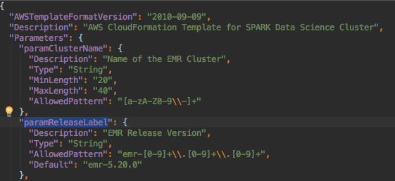
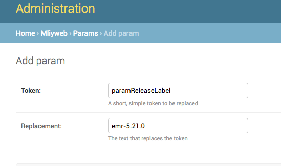

# MLiy Open Source Administrator Guide

[Pre-requisites](#prerequisites)

[Build](#build)

[Install](#install)
- [MLiy Web Application](#mliy-web-application)
- [MySQL RDS](#mysql-rds)

[Post Installation Tasks](#post-installation-tasks)
- [Setup MySQL RDS Connection](#setup-mysql-rds-connection)
- [Create an Admin User](#create-an-admin-user)
- [Create a Manager Group](#create-a-manager-group)

[Initial Setup and Ongoing maintenance](#initial-setup-and-ongoing-maintenance)

[Configuring MLiy Image](#configuring-mliy-image)

[Configuring Clusters](#configuring-clusters)
- [Cluster Specific Parameters](#emr-specific-parameters)
- [Cluster Cloudformation Parameters](#cluster-cloudformation-parameters)
    - [Provided Parameters](#provided-parameters)
    - [Custom Parameters](#custom-parameters)
- [Cluster Troubleshooting](#cluster-troubleshooting)
    - [Logs](#logs)
    - [Common Cluster Problems](#common-cluster-problems)
[Configuring the Spark Cluster](#configuring-the-spark-cluster)

[Administrator Commands](#administrator-commands)
- [Refresh Models](#refresh-models)
- [Sync Cloudformation](#sync-cloudformation)
- [Load Data](#load-data)

[Django Administrator Documentation](#django-administrator-documentation)


## Prerequisites

- AWS Account with subnets in a VPC
- Knowledge of how to launch EC2, CloudFormation, ELB and RDS resources in AWS
- The ability to SSH into the MLiy Web Application's EC2 instance
- SSL Certificate for MLiy website and wildcard certificate for application domain.
- Active Directory (AD) listening on LDAPS. OpenLDAP with memberOf overlay is supported (see section [Support for OpenLDAP]) .
- An LDAP account to be configured as a service account in order to verify group authorization
- An IAM instance profile for MLiy EC2 instance with ability to manage EC2, EBS, Cloudformation Stack, read access to the S3 bucket containing the MLiy package, and pass role permission to IAM role for MLiy
- An IAM instance profile for MLiy with encrypt/decrypt access to KMS keys and read/write access to S3 buckets
- An IAM role to use create and manage resources. Resources with * means that they might not be be created, and are therefore optional:
  - CloudFormation
  - EC2
  - EBS
  - Auto Scaling Launch Configuration
  - Auto Scaling Group
  - Elastic Load Balancer*
  - RDS DBInstance
  - Route 53*
  - EMR
  - IAM: Instance Profiles
  - SSM
- S3 Bucket(s)
    - Bucket to store bootstrap scripts and step scripts. Unlike EC2 user_data scripts which can be coded into the Cloudformation template, EMR has to reference the buckets for these scripts to run find and run them. When deploying the MLiy web app, deploy the scripts separately to an S3 bucket. Sample scripts are included in the project in scripts/emr/spark
    - Bucket to store logs of the EMR cluster.
    - Bucket to store the MLiy package
    - *NOTE*: These can all be the same bucket
- Security Groups

| Security Group | Inbound                                    | Outbound                                     |
| ---            | ---                                        | ---                                          |
| MLiy-elb       | HTTPS port 443 from allowed networks       | HTTPS port 443 to MLiy-web                   |
|                | MLiy-ec2                                   |                                              |
| MLiy-web       | SSH 22 from allowed networks               | MySQL port 3306 on MLiy-db                   |
|                | MLiy-ec2 (if no ELB)                       | LDAP Server port 636                         |
|                | HTTPS port 443 from MLiy-elb (if ELB)      |                                              |
| MLiy-ec2       | SSH port 22 from allowed networks          | MLiy-web port 443                            |
|                | HTTPS port 443 from allowed networks       | Other*                                       |
| MLiy-rds       | MySQL port 3306 from MLiy-web              | No Outbound                                  |
|emr-master      |TCP UDP port 0-65535 from ```emr-master```  | All traffic                                  |
|                |TCP UDP port 0-65535 from```emr-slave```    | All traffic to emr-master                    |
|                |IPv4 from ```emr-master```                  | All traffic to emr-slave                     |
|                |IPv4 from ```emr-slave```                   |                                              |
|emr-slave       |TCP UDP port 0-65535 from ```emr-master```  | All traffic                                  |
|                |TCP UDP port 0-65535 from```emr-slave```    | All traffic to emr-master                    |
|                |IPv4 from ```emr-master```                  | All traffic to emr-slave                     |
|                |IPv4 from ```emr-slave```                   |                                              |

*to the internet, proxy, data services, internal network, etc.

## MLiy Web Application

MLiy is installed through CloudFormation and will launch an EC2 instance via Auto Scaling Group and Launch Configuration.
The Launch Configuration runs its User Script, which are shell commands to install the application in the EC2 instance once it is ready.

Options:

- ELB: If an ELB name is specified in params.json, it will create an ELB with multi-AZ support
- Route 53: If CreateRoute53ElbCnameRecord is set to TRUE in params.json, it will create a Route 53 Alias record mapping to the ELB created earlier.
- MySQL RDS: If using MySQL for data store, set DatabaseType to mysql and create the mysql database before installing MLiy web application (see the [MySql RDS](#mysql-rds) Section).

Checkout the MLiy project from Git. Parameters and default values can be obtained from the Cloudformation template "./scripts/AWS_APP_MLiy_CloudFormation.yaml". To simplify deployment, a [params.json] and [deployment.sh] scripts are provided in the ./scripts folder.
- Set the values for your environment in param.json. Leave optional or unused values blank ""

`scripts/params.json`
```
[	{
		"ParameterKey": "TimeZone",
		"ParameterValue": "TimeZone the application is hosted on"
	},{
		"ParameterKey": "LanguageCode",
		"ParameterValue": "Language Code for the application to use"
	},{
		"ParameterKey": "KeyName",
		"ParameterValue": "The SSH key pair to use"
	},{
		"ParameterKey": "ImageId",
		"ParameterValue": "The AMI (Amazon Machine Image) to use"
	},{
		"ParameterKey": "InstanceType",
		"ParameterValue": "The EC2 instance type to use"
	},{
		"ParameterKey": "IamInstanceProfile",
		"ParameterValue": "The instance profile to use"
	},{
		"ParameterKey": "SecurityGroups",
		"ParameterValue": "Security Groups to associate with Launch Configuration"
	},{
		"ParameterKey": "SourceBucket",
		"ParameterValue": "The source S3 bucket where the installation script is located. Do not prefix with s3://"
	},{
		"ParameterKey": "SourcePackage",
		"ParameterValue": "The name of the installation package"
	},{
		"ParameterKey": "SourceScript",
		"ParameterValue": "The name of the installation script"
	},{
		"ParameterKey": "elbName",
		"ParameterValue": "The name to use for the ELB"
	},{
		"ParameterKey": "elbSubnets",
		"ParameterValue": "The subnets to use for the ELB"
	},{
		"ParameterKey": "elbSecurityGroups",
		"ParameterValue": "The security groups to use for the ELB"
	},{
		"ParameterKey": "elbSSLCertificateId",
		"ParameterValue": "The ARN of the SSL certificate to use. For more information about SSL certificates, see http://docs.aws.amazon.com/IAM/latest/UserGuide/ManagingServerCerts.html in the AWS Identity and Access Management documentation."
	},{
		"ParameterKey": "elbhealthUrl",
		"ParameterValue": "The health check URL to use for the ELB (format: [PROTOCOL]:[PORT]/[PATH])"
	},{
		"ParameterKey": "elbHealthyThreshold",
		"ParameterValue": "The number of consecutive health checks successes required before moving the instance to the Healthy state"
	},{
		"ParameterKey": "elbUnhealthyThreshold",
		"ParameterValue": "The number of consecutive health check failures required before moving the instance to the Unhealthy state"
	},{
		"ParameterKey": "elbInterval",
		"ParameterValue": "The approximate interval, in seconds, between health checks of an individual instance"
	},{
		"ParameterKey": "elbTimeout",
		"ParameterValue": "The amount of time, in seconds, during which no response means a failed health check"
	},{
		"ParameterKey": "asGroupMinSize",
		"ParameterValue": "The min size to use for the autoscaling group"
	},{
		"ParameterKey": "asGroupMaxSize",
		"ParameterValue": "The max size to use for the autoscaling group"
	},{
		"ParameterKey": "asVpcSubnets",
		"ParameterValue": "The subnet(s) to use for the autoscaling group"
	},{
		"ParameterKey": "asCooldown",
		"ParameterValue": "The number of seconds after a scaling activity is completed before any further scaling activities can start."
	},{
		"ParameterKey": "asHealthCheckGracePeriod",
		"ParameterValue": "The length of time in seconds after a new EC2 instance comes into service that Auto Scaling starts checking its health."
	},{
		"ParameterKey": "asHealthCheckType",
		"ParameterValue": "The service you want the health status from, Amazon EC2 or Elastic Load Balancer. Valid values are EC2 or ELB."
	},{
		"ParameterKey": "asMinSuccessfulInstancesPercent",
		"ParameterValue": "Specifies the percentage of instances in an Auto Scaling rolling update that must signal success for an update to succeed."
	},{
		"ParameterKey": "asPauseTime",
		"ParameterValue": "The amount of time that AWS CloudFormation pauses after making a change to a batch of instances to give those instances time to start software applications."
	},{
		"ParameterKey": "signalCount",
		"ParameterValue": "The number of success signals AWS CloudFormation must receive before it sets the resource status as CREATE_COMPLETE"
	},{
		"ParameterKey": "signalTimeout",
		"ParameterValue": "The amount of time to wait before timing out due to not receiving a cfn-signal from instances in the autoscaling group"
	},{
		"ParameterKey": "DjangoSecretKey",
		"ParameterValue": "The secret key for a particular Django installation. This is used to provide cryptographic signing, and should be set to a unique, unpredictable value."
	},{
		"ParameterKey": "LdapAuthUrl",
		"ParameterValue": "Specifies the LDAP server, the base DN, the attribute to use in the search, as well as the extra search filter to use."
	},{
		"ParameterKey": "LdapBindDn",
		"ParameterValue": "A DN to bind with during the search phase."
	},{
		"ParameterKey": "LdapBindPassword",
		"ParameterValue": "Command to run to obtain the password for above user"
	},{
		"ParameterKey": "LdapGroupAttribute",
		"ParameterValue": "Authorize member of this group to access Mliy Web Application"
	},{
		"ParameterKey": "LdapAdminGroupAttribute",
		"ParameterValue": "Authorize member of this group to manage MLiy Web Application"
	},{
		"ParameterKey": "LdapDisableCertValidation",
		"ParameterValue": "Disable SSL certificate validation when connecting to the LDAP server"
	},{
		"ParameterKey": "ManagerHostname",
		"ParameterValue": "The Fully Qualified Hostname of the EC2 instance hosting MLiy web application"
	},{
		"ParameterKey": "DnsService",
		"ParameterValue": "DNS service to use for MLiy-launched instances."
	},{
		"ParameterKey": "DomainName",
		"ParameterValue": "The domain used (eg Route53 Hosted Zone) when managing DNS records"
	},{
		"ParameterKey": "AppDns",
		"ParameterValue": "The Fully Qualified DNS of application that maps to ELB. This is what will be used to access the application"
	},{
		"ParameterKey": "DnsApiUrl",
		"ParameterValue": "The DNS REST API URL to use to register and unregister A record for MLiy instances"
	},{
		"ParameterKey": "DnsMliyDomain",
		"ParameterValue": "The DNS Domain to use to register and unregister A record for MLiy instances"
	},{
		"ParameterKey": "DnsApiData",
		"ParameterValue": "Any Data Payload to send to DNS API REST Services"
	},{
		"ParameterKey": "CreateRoute53ElbCnameRecord",
		"ParameterValue": "Create a DNS CNAME Record AppDns in Route53 hosted zone DomainName that maps to ELB: TRUE or FALSE"
	},{
		"ParameterKey": "DatabaseType",
		"ParameterValue": "The Database Type supporting MLiy web application"
	},{
		"ParameterKey": "DatabaseName",
		"ParameterValue": "If using mysql, provide database name"
	},{
		"ParameterKey": "DatabaseHostname",
		"ParameterValue": "If using mysql, provide database hostname"
	},{
		"ParameterKey": "DatabaseUserName",
		"ParameterValue": "If using mysql, provide database username to connect with"
	},{
		"ParameterKey": "DatabaseUserPassword",
		"ParameterValue": "If using mysql, provide database password of the username to connect with"
	},{
		"ParameterKey": "DatabaseInitialize",
		"ParameterValue": "Initialize specified database with tables and default data. This needs to be TRUE for initial deployment and FALSE for subsequent deployments."
	},{
		"ParameterKey": "ProxyScript",
		"ParameterValue": "The name of the proxy script injected in the scripts folder that set proxy variables in order to download packages"
	}
]
```

- Uncomment and set the following values for your environment in deployment.sh

```
AWS_DEFAULT_REGION="Amazon Region"
STACK_NAME="Unique Cloudformation Stack Name to create"
TAGS="Key Value pairs to tag AWS resource with"
```
- Permissions required for the role which runs the AWS CLI in deployment.sh:
    - launch CloudFormation Stack
    - launch EC2 instances
    - launch AutoScaling Launch Configuration
    - launch AutoScaling Groups
    - Ability to create Route53 record in appropriate zone

### Build

Change directory to the scripts folder  and run the following command to build:
```
cd scripts
bash build.sh
```
MLiy package mliyweb.tar.gz is generated in the ./dist folder. Stage the ./dist/mliyweb.tar.gz file in an S3 location.
This package will be used for installing the MLiy Web Application and the MLiy Image (in the EC2 instances started from the MLiy Web Application).

### Install

_Deployment Command_
```
cd scripts
bash ./deployment.sh
```

## MySQL RDS
MLiy deployment script creates Django models in the included sqllite3 database. You will want to use a separate MySQL database for production deployments.

Parameters and default values can be obtained from the template ./scripts/AWS_RDS_MLiy_CloudFormation.yaml.
- Permissions required for the role
  - launch RDS

Minimum Cloudformation Parameters:

- DBName: The database name.
- MasterUsername: The database admin account username.
- MasterUserPassword: The database admin account password
- VPCSecurityGroups: The list of VPC security groups that contains instances that need access to the database
- DBSubnetGroupName: A DB subnet group to associate with the DB instance.
- KmsKeyId: The ARN of the AWS Key Management Service (AWS KMS) master key that's used to encrypt the DB instance.
- DBParameterGroupName: The name of an existing DB parameter group.
- OptionGroupName: The option group that this DB instance is associated with.

## Post Installation Tasks
The following tasks require the user to SSH into the EC2 instance for MLiy web application.

### Setup MySQL RDS Connection
If the default sqllite database needs to be replaced with mysql without a new MLiy web application deployment, make the following changes on the EC2 instance:

1. On the MLiy web application server, set DB_TYPE to mysql and replace {{{}}} with appropriate values for your MySQL Database in ~mliyapp/mliyweb/mliyweb/settings.py file as user mliyapp:

```
DB_TYPE = 'mysql'

MYSQLDB = {
    'default': {
        'ENGINE': 'django.db.backends.mysql',
        'NAME' : '{{{db_name}}}',
        'HOST' : '{{{db_host}}}',
        'PORT' : '3306',
        'USER' : '{{{db_user}}}',
        'PASSWORD' : '{{{db_passwd}}}',
        'OPTIONS' : {
                'charset' : 'utf8',
                'ssl': {'ca': '/etc/aws-rds/ssl/rds-combined-ca-bundle.pem'},
        }
    }
}
```

2. Go to the ~mliyapp/mliyweb folder and run the following commands to create the models in your MySQL RDS:
```
source ../mliy-python/bin/activate
python manage.py makemigrations
python manage.py migrate
python manage.py sync_cf
```
3. Restart apache as root:
```
apachectl stop
apachectl start
```

### Create an Admin User
If LDAP LdapAdminGroupAttribute is specified, this step may not be needed. By default, Django provides a login page for the Admin site. However, if the is_staff=True is set in the plugin, this step can be bypassed. Setting is_admin=True also gives users admin status and access to all the features of the Django admin console. See the example plugin in ldapplugin/ldapauth.py

Logon to MLiy instance using the SSH Key-pair and sudo to mliyapp user and change to mliyweb directory:
```
sudo su ??? mliyapp
cd mliyweb
```
Activate the Python virtual environment:
```
source ../mliy-python/bin/activate
```
Run the following command to create an admin user:
```
python manage.py createsuperuser
```
You will be prompted to enter a username, email address and associated password. Please keep the credentials in a safe location.

You should now be able to open the MLiy website in a browser, click on ???Log in to My Dashboard??? on the top right corner, and logon with administrative credentials.

### Create a Manager Group
You will need to create a manager group to assign users to. The manager group is defined in the settings file. If you use the simpledb fixture provided with the website and the default settings file the group is created automatically, named manager. Otherwise you will need to create a group with a matching name in the admin view.

## Initial Setup and Ongoing Maintenance
Before you are able to launch and start using MLiy instances, you will need to create and register (see pre-requisites) some AWS resources.  Logon to MLiy Admin console using the URL https://dns_entry_for_mliy_with_ssl_cert/admin. You will see a screen similar to the following:


Click on the Home link on the top left corner and click on Security Groups and add one or more valid security groups in the VPC, including MLiy-ec2 created earlier in pre-requisites.


Click on the Home link on the top left corner and click on Instance Types and add one or more valid EC2 instance types (Look at allowed values for instance types in scripts/ec2/AWS_EC2_MLiy_CloudFormation).


Click on the Home link on the top left corner and click on Groups and add one or more groups.


If MLiy is configured to use an LDAP/Active Directory server, a user will be added automatically the first time the user logs on. If MLiy is configured to use the local database for authentication, click on the Home link on the top left corner and click on Users and add one or more users. If you are prompted to enter a password when saving, use "No password set." This field is not used.


Click on the Home link on the top left corner and click on Group Configs and add one or more group configuration. Select the group created earlier from the drop down box and give the group configuration a name (usually the same as the group name). If a user is a member of the specified AD group, the user will automatically provisioned to this group and group configuration. Select any instance types to exclude, default security groups to use (in order to limit access to data and services) and optional security groups.


In order to identify EC2 instances launched by this group, provide an instance name.  Provide project name code and charge code and software development tags for AWS resources. Associate SSH keypair and IAM instance profile with this group configuration.


Click on the Home link on the top left corner and click on Software Configs and add one or more software configuration. Give the software configuration a name. Specify the shell script to run during instance provisioning and associated AWS Cloudformation template to call from the drop downs. Add or select parameters to replace tokens with your actual values in the shell script. Specify the AMI ID to launch the EC2 instance with. Select the compatible EC2 instance types for this software configuration.


Associate the groups/group configurations permitted to use this software configuration.  Specify the default instance name launched with this software configuration if none is provided in the group configuration. Describe the software configuration in HTML format; users will see text when launching this software configuration.


Specify the KMS key to encrypt the EBS volume, the device path the volume to be made available to the instance, and the default size of the volume.


## Configuring MLiy Image

MLiy web application package includes a sample MLiy EC2 image in scripts/ec2 folder: bootstrap script userdata_MLiy.sh and the associated AWS Cloudformation template AWS_EC2_MLiy_CloudFormation.json. Place custom userdata scripts into this folder and run "python manage.py sync_cf" from inside the EC2 instance for MLiy web application (see [Administrator Commands](#administrator-commands)). This will make the script selectable in the Django Admin console > Software Config.

You will notice tokens ({{{TEXT}}}) in the userdata bootstrap script. You can add parameters in Software Configuration or in Parameters to search and replace these tokens with appropriate values and set the environment variables to pass on to MLiy image. For example, add a parameter to replace token SOURCE_BUCKET with actual value of the bucket name. The MLiy web application deployment will create these parameters with associated descriptions as their value if DatabaseInitialize is set to TRUE.

Here is a sample of Params to set in the Admin interface:


`userdata_Mliy.sh`
```
# There is a limit of 4096 bytes on Cloudformation parameters.
# Keep the text within the limit or else the instance launch will fail.
export SOURCE_BUCKET='{{{SOURCE_BUCKET}}}'
export SOURCE_SCRIPT='{{{SOURCE_SCRIPT}}}'
export SOURCE_PACKAGE='{{{SOURCE_PACKAGE}}}'
export EBS_DEVICE='{{{EBS_DEVICE}}}'
export TIME_ZONE='{{{TIME_ZONE}}}'
export MANAGER_HOSTNAME='{{{MANAGER_HOSTNAME}}}'
export CRAN_REPO='{{{CRAN_REPO}}}' # R Repository URL
export PyPi_REPO='{{{PyPi_REPO}}}' # Python Repository URL
export LDAP_TYPE='{{{LDAP_TYPE}}}'
export LDAP_HOST_NAME='{{{LDAP_HOST_NAME}}}'
export LDAP_USER_ID='{{{LDAP_USER_ID}}}'
export LDAP_USER_PASSWD_CMD='{{{LDAP_USER_PASSWD_CMD}}}'
export LDAP_USER_BIND_DN="{{{LDAP_USER_BIND_DN}}}"
export LDAP_BASE_DN='{{{LDAP_BASE_DN}}}'
export LDAP_AUTHZ_GROUP="{{{LDAP_AUTHZ_GROUP}}}"
export DISABLE_LDAP_CERT_VALIDATION="{{{DISABLE_LDAP_CERT_VALIDATION}}}"
export DISABLE_LIVY_CERT_VALIDATION="{{{DISABLE_LIVY_CERT_VALIDATION}}}"
export WILDCARD_CERTS_ARCHIVE='{{{WILDCARD_CERTS_ARCHIVE}}}'
export WILDCARD_PUBLIC_CERT='{{{WILDCARD_PUBLIC_CERT}}}'
export WILDCARD_PRIVATE_CERT='{{{WILDCARD_PRIVATE_CERT}}}'
export CUSTOM_ROOT_CERTS='{{{CUSTOM_ROOT_CERTS}}}'
export PROXY_SCRIPT='{{{PROXY_SCRIPT}}}'

cd ~
mkdir MLiy
cd MLiy
aws s3 cp s3://$SOURCE_BUCKET/$SOURCE_PACKAGE .
if [[ ! -z ${PROXY_SCRIPT} ]]; then
	tar xzf $SOURCE_PACKAGE scripts/${PROXY_SCRIPT} scripts/ec2/MLiy
else
	tar xzf $SOURCE_PACKAGE scripts/ec2/MLiy
fi
if [[ -f scripts/${PROXY_SCRIPT} ]]; then
  export PROXY_SCRIPT="$(pwd)/scripts/${PROXY_SCRIPT}"
fi
rm -rf $SOURCE_PACKAGE
cd scripts/ec2/MLiy
export SCRIPT_DIR=$(pwd)
bash $SOURCE_SCRIPT
```
Here is the list of parameters and their associated description required for the sample MLiy image:

| Parameter Key     | Description of Value
|---             |---
| SOURCE_BUCKET  | S3 Location of MLiy packages and supporting files without the s3 prefix
| SOURCE_SCRIPT  | install_ec2_MLiy.sh
| SOURCE_PACKAGE  | mliyweb.tar.gz
| EBS_DEVICE  | /dev/xvdz
| TIME_ZONE  | Set Time Zone. See https://en.wikipedia.org/wiki/List_of_tz_database_time_zones
| MANAGER_HOSTNAME  | The DNS resolvable hostname or IP address for MLiy Website
| CRAN_REPO  | CRAN http://cran.r-project.org/
| PyPi_REPO  | URL for Python Repo. Keep it blank to use pypi.org
| LDAP_TYPE  | Possible Values: AD or openLDAP
| LDAP_HOST_NAME  | LDAP Server Hostname/IP
| LDAP_USER_ID  |  LDAP user id used to connect to ldap server
| LDAP_USER_BIND_DN  | Distinguish Name of Connecting User
| LDAP_USER_PASSWD_CMD  | Command to execute in order to obtain password. Use 'echo password' to simply enter a password
| LDAP_BASE_DN  | LDAP Base DN
| LDAP_AUTHZ_GROUP  | Member of group authorized to access
| DISABLE_LDAP_CERT_VALIDATION | Disable LDAP SSL Cert Validation or not. One of two values: true or false
| DISABLE_LIVY_CERT_VALIDATION | Disable Livy SSL Cert Validation or not. One of two values: true or false
| WILDCARD_CERTS_ARCHIVE   | tar.gz containing SSL cert
| WILDCARD_PUBLIC_CERT  | Name of public cert file in tar.gz
| WILDCARD_PRIVATE_CERT   | Name of private key file in tar.gz
| CUSTOM_ROOT_CERTS  | Custom Root Cert to add to Linux trust store and Java Key Store
| PROXY_SCRIPT  | The name of the proxy script injected in the scripts folder that set proxy variables
Use blank value if a parameter is not used.

## Configuring EMR Clusters
MLiy web application packages includes sample image for Spark cluster in scripts/emr folder: the CloudFormation template AWS_EMR_Spark_MLiy_CloudFormation.json and the assocyaed bootstrap and step scripts in the spark folder. Place custom EMR CloudFormation template into the folder scripts/emr and run "python manage.py sync_cf" from inside the EC2 instance for MLiy web application (see Administrator Commands). This will make the template selectable in the Django Admin console > Software Config. Software Configurations can be used for creating either Instances or Clusters, but not both. If the EMR config box is checked, MLiy will not use any of the parameters in the Instance Configurations area, and the Software Configuration becomes EMR exclusive.

### Giving Users Cluster Access
To give the user access to launching clusters, they must be in a Group that has an associated Group Config with a cluster Software Config.
Group (has a) Group Config (has a) Cluster Software Configuration.

In Software Config: Select Group Config(s) and check the "Emr config" box.


In Group Config: Associate Group with Group Config


In Users: Add the user to the Group that has the Cluster Software Config


The user should now have access to launching clusters.

### Setting the Cluster Auto Termination Default
The provided Spark Cluster template has an option to automatically terminate if it is left idle for a specified amount of time. By default this is set to 0 Hours and 0 Minutes, which is equivalent to "auto termination disabled". This can be set through the Group Config by specifying "cluster_auto_termination_minutes=90" in the "Group Settings" field in the Admin Console > Group Configs > (specific Group  Config).


### AWS Systems Manager Document
MLiy instances and clusters include a iPython custom magic, MliyMagic, which can be used to deploy application jars or zips to Spark classpath in all already running EMR nodes. The library uses AWS Systems Manager Run Command to remotely and securely manage the configuration of your managed instances. The EC2 Instance profile (IAM Role) used to launch the MLiy instance and cluster must be able to invoke SSM Documents and read the specified library file in S3 bucket.

### Cluster Specific Parameters

The EMR master, slave, and additional security groups for master and worker nodes can be set here.

In the "Custom url format" section, the admin can customize the connection to the master node. The text "{{{ URL }}}" will be replaced with the IP address or DNS name. For example, if a Hive cluster is meant to be connected through JDBC, it can be specified here with "jdbc:hive://{{{ URL }}}:10001". This will be displayed as "jdbc:hive//10.20.30.40:10000" (or "jdbc:hive://your_hive_url:10000" if a DNS name is provided) once the cluster is created.

If left blank, or if the text doesn't contain "{{{ URL }}}", it will default to the IP (or DNS name if provided).


### Cluster Cloudformation Parameters

A set of Cluster Cloudformation parameters are taken from the Django Admin page through Group Config, Software Config, and Params tables. The fields in these provide parameters that can be used in Cloudformation.

There is also an option to provide custom parameters through Software Config and Params tables.

#### Provided Parameters
MLiy provides a set of parameters that gets passed into the Cloudformation template. These are derived from the settings.py in MLiy web application and Software Config and Group Config in the Django Admin console, as well as from user input in the MLiy web application. The Cloudformation template must have the corresponding Parameter Key in order to use these parameters.

Note that these are optional. The Cloudformation template does not have to have all of these parameters. MLiy will not include the parameter if it is not in the Cloudformation template.

###### Parameters set from **settings.py**:
|Parameter Key|Description|Example Parameter Input|
|---|---|---|
|paramTimeZone|Same as the time zone set in the MLiy webapp|US/Eastern (same timezone as MLiy Web)|

###### Parameters set from **Group Config**:

|Parameter Key|Description|Example Parameter Input|
|---|---|---|
|paramEnvironment|Software development environment|DEV|
|paramAGS|Tag for the application|MLIY|
|paramSubnetID|Subnet of the cluster, based on the subnet of the MLiy webapp.|subnet-12345678|
|paramEc2KeyName|Key Pair used to access the master node.|MY_KEYPAIR_ON_EC2|

###### Parameters set from **Software Config**:

|Parameter Key|Description|ExampleParameter Input|
|---|---|---|
|paramInstanceType|Instance type to run the clusters on. For multiple types, use custom Cloudformation templates.|r3.4xlarge|
|paramEMRManagedMasterSecurityGroup|Main security group for the master node.|sg-00000000|
|paramEMRManagedSlaveSecurityGroup|Main security group for the slave nodes.|sg-00000000|
|paramAdditionalMasterSecurityGroups|Additional master security groups. These follow the format of ```List<AWS::EC2::SecurityGroup::Id>```. |sg-00000000,sg-11111111,sg-22222222|
|paramAdditionalSlaveSecurityGroups|Additional slave security groups. These follow the format of ```List<AWS::EC2::SecurityGroup::Id>```. |sg-00000000,sg-11111111,sg-22222222|

###### Parameters set by user input:

|Parameter Key|Description|ExampleParameter Input|
|---|---|---|
|paramMarketType|Market type of the cluster, SPOT or ON_DEMAND.|Checkbox on the MLiy web app. If checked, the value is ON_DEMAND. If unchecked, the value is SPOT.|
|paramCoreInstanceCount|Number of core nodes on the cluster.|Input on the MLiy web app. Numbers will be passed in as Strings into the Cloudformation template.|
|paramTaskInstanceCount|Number of task nodes on the cluster|Input on the MLiy web app. Numbers will be passed in as Strings into the Cloudformation template.|
|paramBidPrice|Bid price for SPOT clusters.|Input on the MLiy web app. Numbers will be passed in as Strings into the Cloudformation template.|

#### Custom Parameters
MLiy provides a way to specify custom parameters for Cluster Cloudformation templates. The application parses the Cloudformation template for Parameters. It then passes in the corresponding values specified in the Software Config's Params.

The following is an example from a sample template provided with MLiy,  AWS_EMR_Spark_MLiy_CloudFormation.json.

1. Get the parameter's name from the Cloudformation template



2. Create a new Param(s)in the Django admin console with the same name as the one in the Cloudformation template and save. Provide the value(s) as needed.



3. Select the Param(s) in the Software Config and save.


4. The parameter will now be included in the input to the Cloudformation template. Note that MLiy will not include the parameter if it is not in the Cloudformation template.

## Configuring the Spark Cluster
MLiy comes with a sample Cloudformation template, AWS_EMR_Spark_MLiy_CloudFormation.json, and scripts to setup a Spark cluster.
The sample does the following:
- Configures an Apache server
  - Uses LDAP for authentication and authorization
  - Uses SSL certificates from an S3 bucket
- Configures Jupyter Hub
  - Uses LDAP for authentication and authorization
  - Uses s3 bucket to store jupyterhub notebooks
- Pulls bootstrap.sh and step.sh scripts from S3 buckets
- Contains a landing page on the master node to applications installed on the cluster

### Spark Cluster Parameters

EMR and Spark parameters must be set via custom parameters in the Params table.

Parameters to set:

| Parameter Key             | Description of Value
|---                        |---
| paramInstallBucket        | S3 bucket base bucket where the bootsrap, step, and certificate is located. e.g. mliy-bucket
| paramBootstrapScript      | S3 bucket 'path' of the cluter's bootstrap script. e.g. /my/path/to/bootstrap.sh
| paramStepScript           | S3 bucket 'path' of the cluster's step script. e.g. /my/path/to/step.sh
| paramCertFile             | S3 bucket 'path' of SSL certificates. e.g. /my/path/to/certs.tar.gz
| paramJupyterBucket        | S3 Bucket to store user home folders and Jupyter notebooks
| paramYumServerPort	      | Port of the custom yum server
| paramYumServerHost	      | Custom yum server host
| paramYumServerPrefix      | Any special prefix associated with the yum server
| paramAWSProxyPort	        | Proxy port if using a proxy
| paramAWSProxyHost	        | Proxy host if using a proxy
| paramLdapGroupRdn	        | LDAP group relative distinguished name
| paramLdapGroup	          | LDAP group
| paramLdapSvcUser	        | LDAP service user
| paramLdapSvcRdn           | LDAP service relative distinguished name
| paramLdapUserRdn          | LDAP user relative distinguished name
| paramLdapBaseDn	          | LDAP based distinguished name
| paramLdapIp	              | IP of the LDAP  server
| paramLdapFqdn	            | LDAP fully qualified distinguished name
| paramYarnLogURI	          | Bucket to store Yarn logs
| paramLogURI	              | Bucket to store EMR logs
| paramSecurityConfiguration| Security configuration of the EMR cluster. See https://docs.aws.amazon.com/emr/latest/ManagementGuide/emr-specify-security-configuration.html
| paramServiceRole	        | IAM service role that EMR assumes to access AWS resources
| paramJobFlowRole	        | IAM role that each EC2 instance in the cluster assumes
| paramInstallSecretsCMD    | Command to install a client that can retrieve LDAP password, such as credstash
| paramRunSecretsCMD        | Command to run a client that can retrieve LDAP password, such as credstash.
| paramJupyterBucket        | Bucket containing user home folders and Jupyter notebooks
| paramSsmDocument          | Name of the AWS SSM Document allowing download of jar/zip file to EMR nodes

After all the parameters are set, launch the cluster as a user. See [User Guide].

Once the cluster is started, the user should be able to log in and view a landing page for Jupyter Hub with links to applications. See [Cluster Guide]

## Cluster Troubleshooting

### Logs

#### Logs on EMR
Assuming the S3 bucket(s) and permissions were configured correctly, logs on EMR can be viewed through the AWS console. Go to EMR > Your Cluster > Steps Tab > Logs. However, these logs will not show if the bootstrap or step fails.


#### Master Node logs
The master node's logs can be viewed through SSH. Follow the instructions on the AWS EMR console > Summary > SSH to access the master node and navigate to /var/logs/. There should be startup logs.

### Common Cluster Problems
Bootstrap fails
- Check to make sure that the EMR Job Flow Role has the right permissions to the S3 buckets.
- Make sure that each command in the bootstrap script works.

Logs aren't appearing anywhere
- Make sure that the EMR Job Flow Role has the right permissions to the S3 buckets
- Make sure that the path to the log is correct.
- The logs tend to appear later after the cluster's steps are completed. Wait a few minutes and refresh the page.

Cannot connect to the cluster
- If the bootstrap and step completed, check the logs in the AWS EMR console > Steps > View logs.
    - Confirm that the Apache server is running.
- If using Apache, it may not be configured right. Check LDAP configurations (if any) and the EMR cluster on AWS console to make sure that the cluster is running.
    - SSL cert could be expired/non-existant. This could cause the Apache server to fail.

Cluster suddenly terminates
- One of the most common causes is that the cluster is created using SPOT pricing. Try again with ON DEMAND pricing checked in the user interface.

Everything is correct but the cluster won't launch
- If this is the first cluster that is being launched by the MLiy web app, there is a possibility that an AWS client configuration error is taking place.
    - To see if this is the case, SSH into the MLiy web instance's EC2. Check the logs at /home/mliyapp/logs/mliylaunch.log. This specific error is "the region must be set".
    - To fix, restart the server in the mliy webapp instance with "apachectl stop" and "apachectl start".


## Administrator Commands

The MLiy website comes with several administrative commands that can be ran from the server instance. These commands implement the django admin command interface. The documentation for these commands can be found here:

[https://docs.djangoproject.com/en/2.0/ref/django-admin/]

#### Invoking using command line

The commands can be invoked using the command line on the instance. This can be done using a crontab, bash script or by directly running the command from the terminal.

To call the command you need to be in the proper python environment. MLiy comes with a virtual environment installed that is already provisioned with all the necessary libraries. This can  be accessed by calling:

```
source ~/mliy-python/bin/activate

cd ~/mliyweb

./manage.py 'command name'
```

#### Invoking using python

The commands can also be called inside python code, for example using the plugin system or when editing the source code. They can be called like so:

```
from django.core.management import call_command

call_command('command name')
```

### Refresh Models

This command will start an update thread to sync the database internal to the website with the actual state of instances in AWS. This thread will also be launched by the website, but in a low traffic volume context it might make sense to run the thread on a schedule. Another use case is running the update thread early morning or after a weekend to make sure the website is prepared for the first user.

The command can be invoked with

```
./manage.py refresh
```

### Sync Cloudformation

This command takes the cloudformation templates and user data scripts from the internal file system and on the s3 location. The file system and s3 locations are located in the settings.py file. They can be set to any location where you will have the cloudformation and user data scripts.

```
DIRECTORY_FILE_LOCATION="scripts/ec2"

S3_FILE_LOCATION=""
```

The command will take the files on s3 and push them to the local repository. It will then populate the internal database with the cloudformation and user data such that you can choose them from a list within software configurations. It can be called with:

```
./manage.py sync_cf
```

Every time you add new bootstrap scripts or edit existing ones, you will have to run the above command to update the database,

### Load Data

This is not a management command, but can be very useful when setting up the website initially. There are two fixtures provided with the site, which can be loaded as per this documentation:

[https://docs.djangoproject.com/en/2.0/ref/django-admin/#django-admin-loaddata]

```
./manage.py loaddata simpledb
```

Loads the database with sample information. This will have to be configured later but gives a starting point to work with. This will only work with at least one user and group already in the website (Probably the website superuser and a test group)

```
./manage.py loaddata instances
```

Loads the database with Amazon instance types. No prerequisites necessary.

# Django Administrator Documentation

Additional information about administrering the django site, including the user auth module can be found at

https://docs.djangoproject.com/en/2.1/ref/contrib/admin/

and on the MLiy site at the relative url

/admin/docs

[Support for OpenLDAP]:./SupportForOpenLdap.md
[config.sh]:../scripts/config.sh
[deployment.sh]:../scripts/deployment.sh
[User Guide]:./UserGuide.md
[Cluster Developer Guide]:./ClusterDeveloperGuide.md
