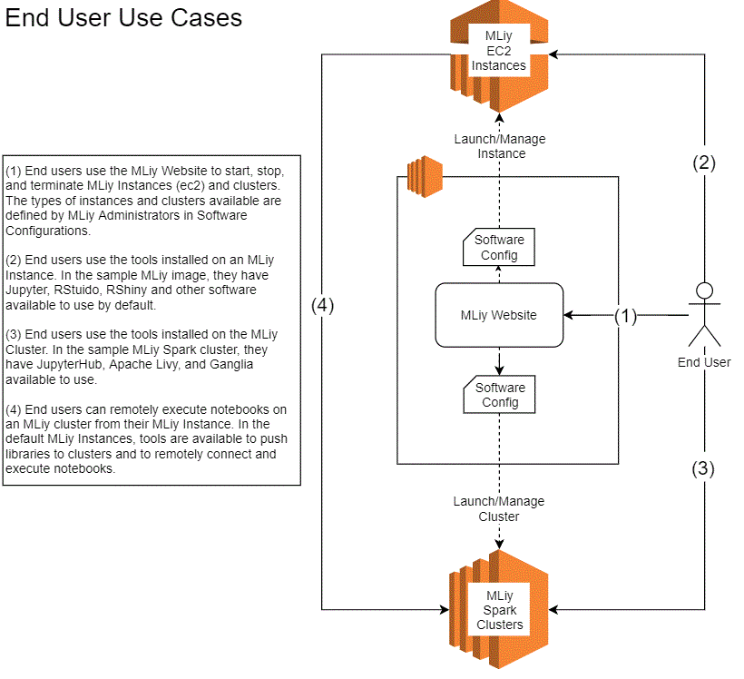
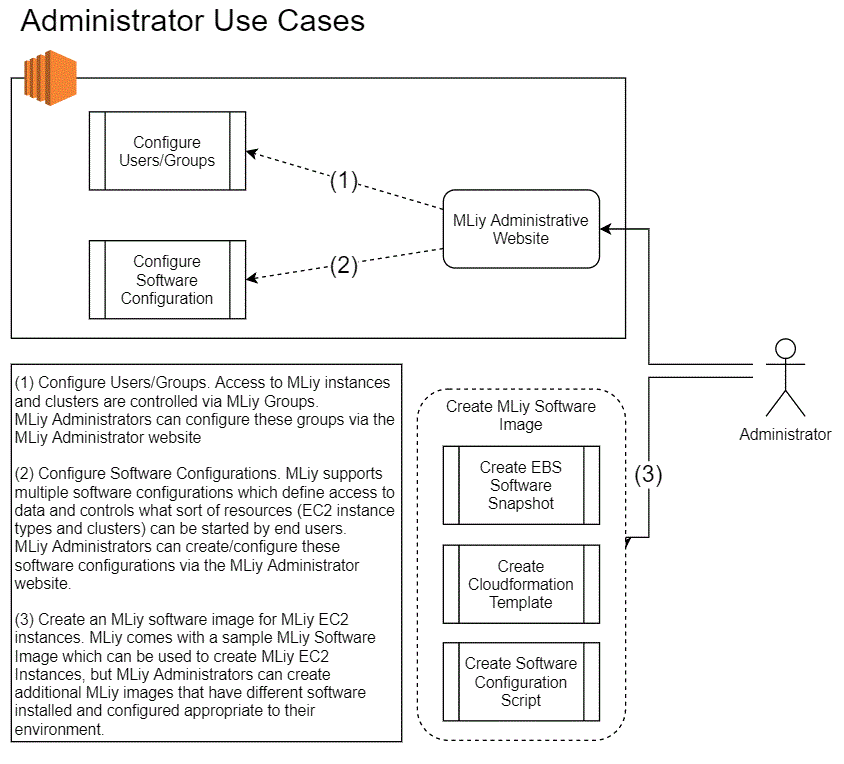

# Getting Started

MLiy (which takes is name from **M**achine **L**earning and is pronounced "Emily") is a configurable, easy-to-use website that allows data scientists to start, manage, and use processing power with machine learning software preinstalled and configured. Administrators can define and manage the available software, depending on the needs of the Data Scientists, while Data Scientists can concentrate on their data analysis.

## Core Design Tenants
### Data Scientists focus on data analysis
MLiy provides an easy-to-use self-service website that provides on-demand resources to allow data scientists to focus on data analysis rather than how to get the hardware or software they need. Data Scientists can spend less time of getting the tools they need and more time learning about the data in front of them.

### Administrators manage resources
MLiy allows administrators to define the types of hardware and sets of software available to data scientists. This allows administrators to make the latest hardware and software available to the Data Scientist while also ensuring security and compliance with organizational policies.

### Manage access to data
Administrators manage data access per group of users. Users can be members of multiple groups and can choose the appropriate access they require for a given task.

## Core Components
### MLiy website
This easy-to-use website is used by Adminsitrators to define the hardware and software available for data scientists to use. And it is used by end users to start, stop, and manage instances to use for data analysis.

### MLiy Software Images
Adminsitrators define one or more sets of software that are used by end users. MLiy comes with a sample image with commonly used machine learning software that can be used or replaced as needed.

## Features
- Manage multiple software configurations
- Manage available types of hardware
- Support multiple data sources
- Allow users to start/stop processing power
- Tag processing power for cost allocation
- On-demand cost and usage reports

## MLiy High-level Diagrams

## MLiy Documentation
- [Administrator Guide](./AdministratorGuide.md)
- [User Guide](./UserGuide.md)
- [Developer Guide](./DeveloperGuide.md)
- [MLiy Open LDAP Guide](./SupportForOpenLdap.md)
- [MLiy Image Guide](./MLiyImageGuide.md)
