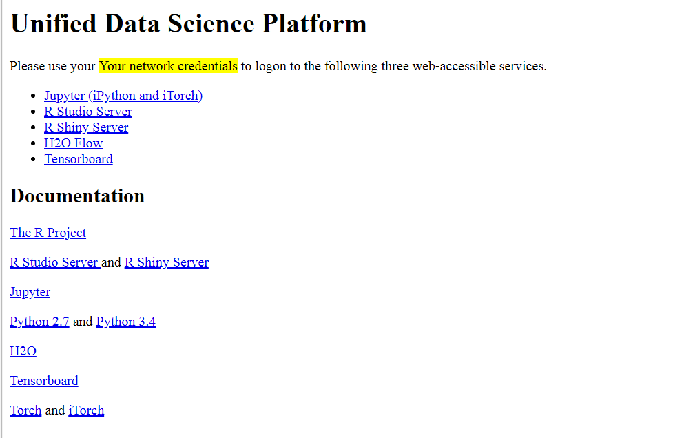
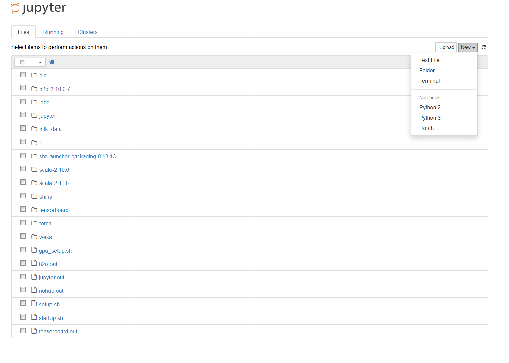
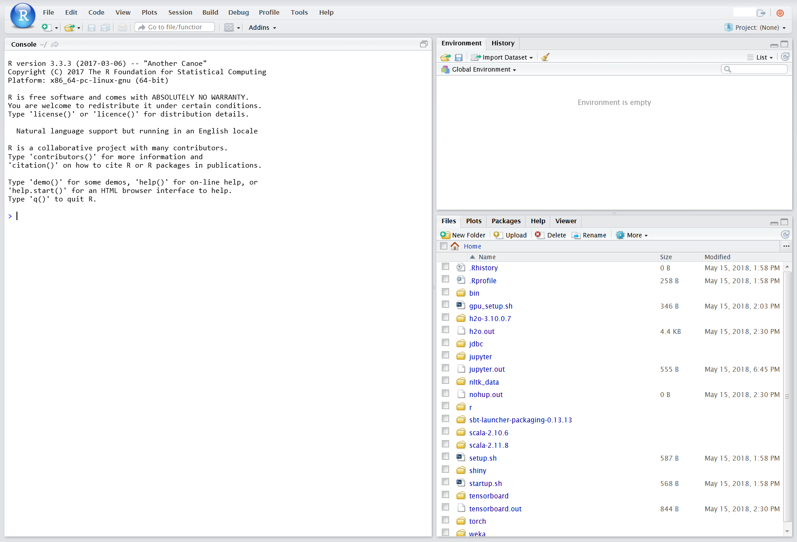
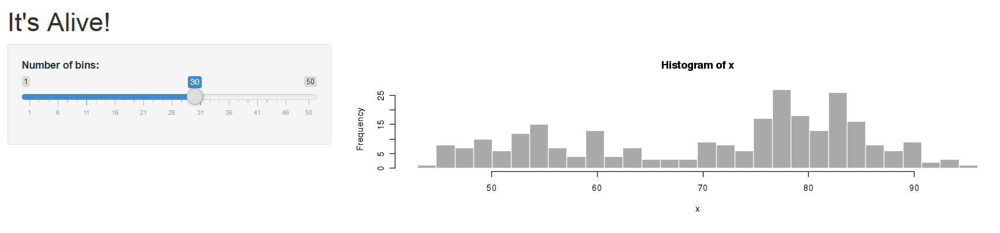
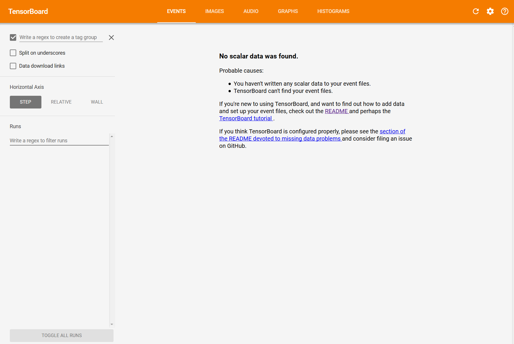

# MLiy Image Guide

MLiy instances are EC2 instances are based on MLiy images provisioned by MLiy Web Application and contain Data Science software and tools. This guide included the features included with the sample MLiy image and how to use them.

## Prerequisites
- SSH key for the MLiy instance (for administrative access) or Membership in a LDAP/Active Directory Group that is authorized to login to the MLiy instance
-	Assigned to a preconfigured group in MLiy Web Application
-	Firefox or Chrome
-	Putty or some other SSH client
-	WinSCP or some other SCP client

## Accessing the MLiy Instance

You can interact with your MLiy instance via the HTTPS and SSH/SCP protocols.
HTTPS

The following services are available via links in your MLiy home page:
-	Jupyter (http://jupyter.org/)
-	R Studio Server (https://www.rstudio.com/)
-	R Shiny Server (https://shiny.rstudio.com/)
-	H2O Flow (https://www.h2o.ai/h2o/)
-	Tensorboard (https://www.tensorflow.org/programmers_guide/summaries_and_tensorboard)

You will be asked to logon with your LDAP/Active Directory credentials when you click on any of the services.



## SSH/SCP

You can logon to your MLiy instance using your LDAP/Active Directory credentials with an SSH client, such as ssh or Putty.

```
ssh your_ldap_ID@instance_ip_or_fqdn
```

You can also upload files to and download files from your MLiy instance using your LDAP/Active Directory credentials with an SCP client such as scp or WinSCP.
```
scp your_file@instance_ip_or_fqdn:/path_to_file/your_file
```

## Using the MLiy Instance
You will use your LDAP/Active Directory credentials to logon to services provided by your MLiy instance.

### Jupyter
In the Jupyter web interface, you can create Python 2.7, Pyhton 3.4 and iTorch notebooks (iTorch works in G2 and P2 instance types only). Go to top/right and click on New. You will see option to select Python2, Python3 or iTorch. You can browse files in your home directory, upload and download files and open a terminal and install python packages.



### Rstudio

In the RStudio web interface, you can write, debug and run your code interactively or using scripts. You can also browse your home directory, download and upload files as well as install or update R packages.



### Rshiny

Save all your Shiny applications (or directories) in the shiny folder of your home directory so that they are available automatically in the RShiny web interface. We include a sample shiny application hello in the shiny folder:


Here is the output of the hello application:



### H2O

You can develop notebooks in H2O using the H2O Flow Web Interface. You can also interact with H2O cluster using R and Python packages.


### Tensorboard

Tensorboard is a visualizing tool for TensorFlow programs. It will only work in G2 and P2 instance types.



### Python 2 and Python 3 Virtual Environments

You will find both kernels in the jupyter folder. You can switch between the two kernels in SSH console. Here is the command to activate Python 2.7:
```
source ~/jupyter/py2_kernel/bin/activate
```
or
```
kernel2
```
Type deactivate to inactivate the kernel
```
deactivate
```
Here are the equivalent commands to switch to Python 3.4
```
source ~/jupyter/py3_kernel/bin/activate
```
or
```
kernel3
deactivate
```
You can interactively work with Python by typing the Python command:
```
python
>>> exit()
```
You can invoke a Python script:
```
python your_script
```
You can use pip to install a package:
```
pip install [package name]
```

### R Shell
You type 'R' to access R Shell via the SSH console:
```
R
q()
```
You can invoke an R script:
```
R -f your_script
Rscript your_script
```
You can install packages. In the R Shell, run the following command:
```
>install.packages("[package name]")
```
### Lua

This feature is only available in G2 and P2 instance types. You can interactively work with Lua via the SSH Console:
```
th
 Type CTRL-C twice or os.exit() to quit
os.exit()
```
You can invoke a Lua script:
```
th your_lua_script.lua
 See http://torch.ch/docs/getting-started.html for more information.
```

### Scala and SBT
Scala  versions 2.10.6 and 2.11.8 and SBT tools are only available via the SSH console. You can switch between the two versions of scala. Type the following to use scala 2.10.6:
```
scala-2.10
```
or
```
 ~/scala-2.10.6/bin/scala
```
Type the following to user scala 2.11.8:
```
scala-2.11
```
or
```
~/scala-2.11.8/bin/scala
```
Invoke the sbt tool with the following command:
```
sbt
```
Please refer to SBT manual at http://www.scala-sbt.org/0.13/docs/index.html and Scala manuals at https://www.scala-lang.org/documentation/ for more information.

### GCC
The GNU compiler in your MLiy instance is version 4.8.5. The user’s environment is already setup to invoke the GCC compiler when installing R or Python packages.
You can compile a C program:
```
gcc -Wall your_code.c -o your_c_application
```

You can compile a C++ application:
```
g++ -Wall your_code.cc -o your_c++_application
```

### Git
You can check out your code from and check-in your code to Git repository. Setup Git in your MLiy instance:
```
mkdir git
cd git
git config --global user.name "Your_First_Name Your_Last_Name"
git config --global user.email YOUR_EMAIL_ADDRESS
git init
```
Setup Remote Git  Repository (You will be prompted to enter password):
```
git remote add origin https://{Your_ID}@fqdn_of_your_git_server/{PROJECT}/{REPOSITORY}.git

git remote -v

git remote show origin

```
Pull Repository (You will be prompted to enter password):
```
git pull origin master
```

### AWS S3
You can use AWS CLI commands via the SSH console or AWS SDK, such as Python Boto, to access AWS resources such as data in S3 buckets using the IAM instance profile assigned to your MLiy instance.
List objects in your S3 bucket:
```
aws s3 ls s3://your_bucket/your_prefix/
```
Copy your file to your S3 bucket:
```
aws s3 cp your_file s3://your_bucket/your_prefix/ --sse-kms-key-id “alias/your_kms_key” --sse aws:kms
```
Copy your object from your S3 bucket to your instance:
```
aws s3 cp s3://your_bucket/your_prefix/your_file .
```

### JDBC
You can use JDBC drivers to connect to SQL data sources. The following JDBC drivers are included in the jdbc directory:
-	Amazon Redshift
-	Amazon Hive
-	Postgres
