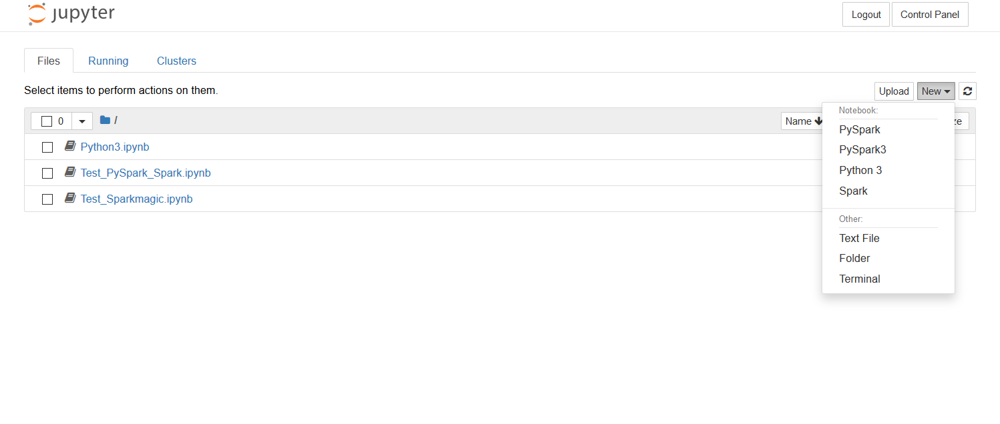
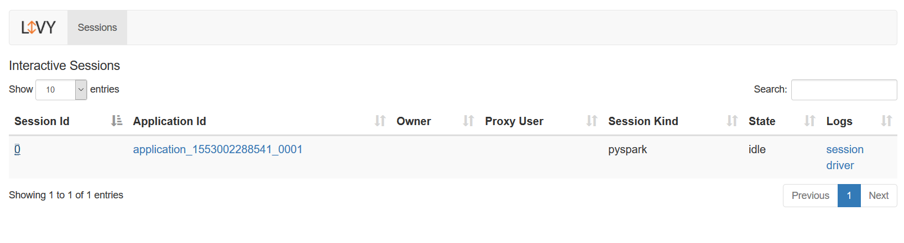
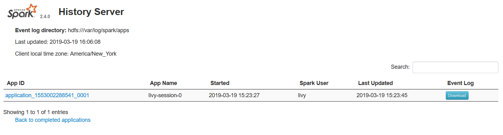
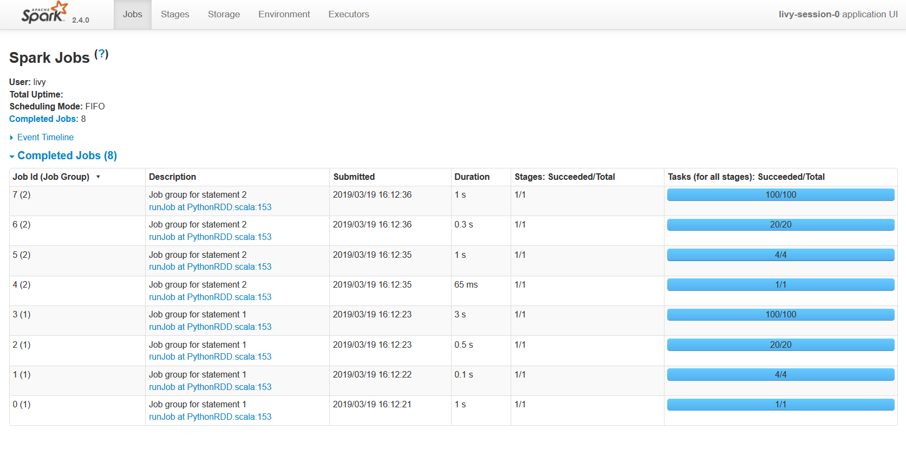
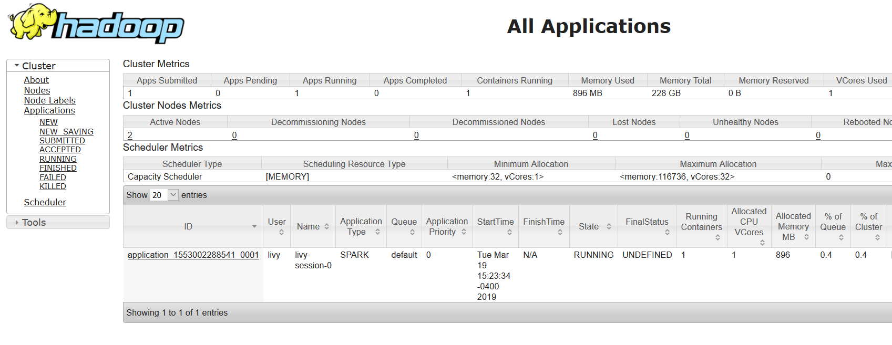
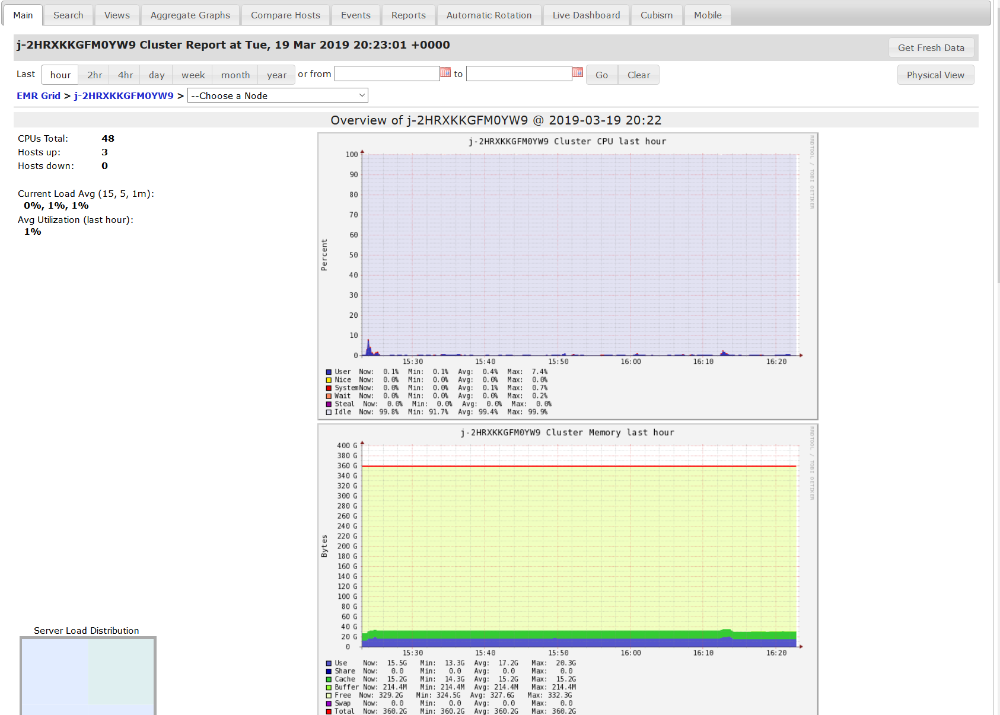

# MLiy Cluster Guide

[Prerequisites](#prerequisites)

[Accessing the MLiy Cluster](#accessing-the-mliy-cluster)

[SSH](#ssh)

[Using the MLiy Cluster](#using-the-mliy-cluster)
- [JupyterHub](#jupyterhub)
- [Apache Livy](#apache-livy)
- [Apache Spark](#apache-spark)
- [Apache Hadoop Yarn](#apache-hadoop-yarn)
- [Ganglia](#ganglia)
- [SparkMagic](#sparkmagic)
- [Addlib Magic](#addlibmagic)

MLiy clusters are AWS EMR clusters (Spark and Hive)  based on MLiy cluster provisioned by MLiy Web Application. This guide lists the features included with the sample MLiy cluster and how to use them.

## Prerequisites
- SSH key for the MLiy Cluster Master Node (for administrative access)
-	Assigned to a preconfigured group in MLiy Web Application
-	Firefox or Chrome

## Accessing the MLiy Cluster

You can interact with your MLiy Cluster via the HTTPS and SSH/SCP protocols.

## HTTPS

The following services are available via links in your MLiy home page:
-	JupyterHub (https://docs.aws.amazon.com/emr/latest/ReleaseGuide/emr-jupyterhub.html and https://jupyterhub.readthedocs.io/en/stable/)
- Apache Livy (https://livy.incubator.apache.org/)
-	Apache Spark (https://spark.apache.org/docs/2.4.0/)
-	Apache Hadoop Yarn (https://hadoop.apache.org/docs/current/hadoop-yarn/hadoop-yarn-site/YARN.html)
-	Ganglia (http://ganglia.info/)

You will be asked to logon with your LDAP/Active Directory credentials when you click on any of the services.


## SSH

If needed for troubleshooting, you can logon to your MLiy Cluster master node using the SSH key specified in EMR cluster confirgurion in MLiy web application.

```
ssh -i /path/to/pem/file hadoop@instance_ip_or_fqdn_of_master_node
```

## Using the MLiy Instance
You will use your LDAP/Active Directory credentials to logon to services provided by your MLiy Cluster master node.

### JupyterHub
In the JupyterHub web interface, you can create PySpark, PySpark3, Python 3 and Spark (Scala) notebooks . Go to top/right and click on New. You will see the option to select PySpark, PySpark3, Python 3 and Spark. You can browse files in your home directory in S3, and upload and download notebooks.



### Apache Livy
Apache Livy is REST Service for Apache Spark. The Apache Livy user interface allows you to monitor active Livy sessions and logs.



### Apache Spark

Spark History Server lists active Spark application and provide details about the associated Spark job.




### Apache Hadoop Yarn

Yarn is resource manager for Hadoop. It helps monitor Spark applications scheduled in Yarn.



### Ganglia

Ganglia provides a web-based user interface to view the metrics, including Hadoop and Spark metrics, for nodes in the cluster.



### SparkMagic

Sparkmagic (https://github.com/jupyter-incubator/sparkmagic) is a library of kernels that allows Jupyter notebooks to interact with Apache Spark through Apache Livy. There are two ways to use Sparkmagic:
1. Via the IPython kernel (https://github.com/jupyter-incubator/sparkmagic/blob/master/examples/Magics%20in%20IPython%20Kernel.ipynb)
2. Via the PySpark (https://github.com/jupyter-incubator/sparkmagic/blob/master/examples/Pyspark%20Kernel.ipynb)  and Spark (https://github.com/jupyter-incubator/sparkmagic/blob/master/examples/Spark%20Kernel.ipynb) kernels

### Addlib Magic
Once a cluster is up and running and you have logged on and created a notebook, you can use iPython custom magic, addlib_magic, to deploy your library as jar or zip file and import that library in your notebook cell and use it. Here is a sample code to load the magic and use it:

```
%load_ext addlib_magic
```

```
%addlib {Absolute S3 Path to Jar or Zip file}
```
