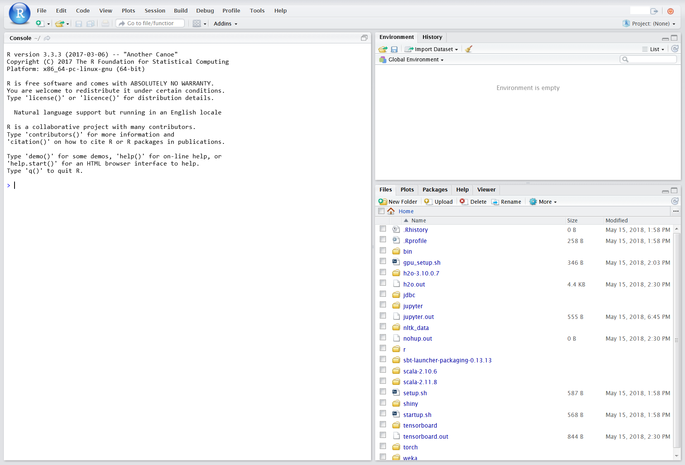
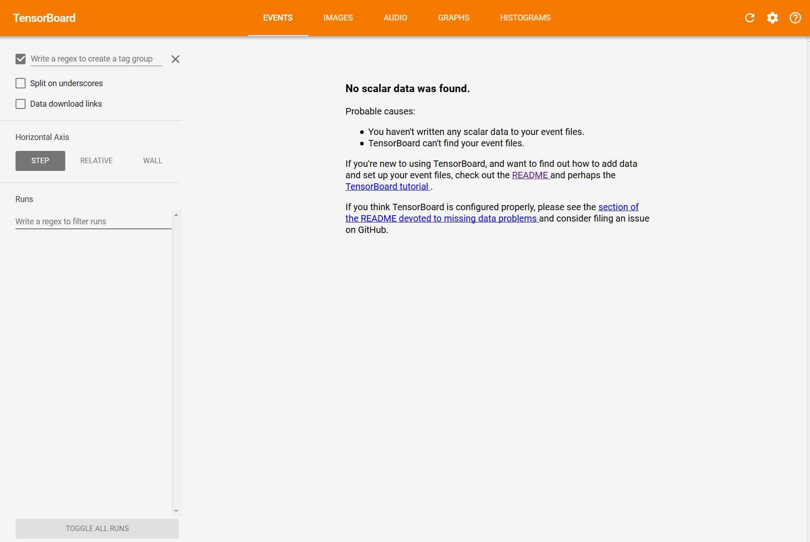

# MLiy Image Guide

[Prerequisites](#prerequisites)

[Accessing the MLiy Instance](#accessing-the-mliy-instance)

[SSH and SCP](#ssh-and-scp)

[Using the MLiy Instance](#using-the-mliy-instance)
- [Jupyter](#jupyter)
- [Rstudio](#rstudio)
- [Rshiny](#rshiny)
- [H2O](#h2o)
- [Tensorboard](#tensorboard)
- [Python 2 and Python 3 Virtual Environments](#python-2-and-python-3-virtual-environments)
- [R](#r)
- [Lua and Torch](#lua-and-torch)
- [Scala and SBT](#scala-and-sbt)
- [Spark](#spark)
- [GCC](#gcc)
- [Git](#git)
- [AWS S3](#aws-s3)
- [JDBC](#jdbc)

[EBS Snapshots](#ebs-snapshots)

MLiy instances are EC2 instances  based on MLiy images provisioned by MLiy Web Application and contain Data Science software and tools. This guide lists the features included with the sample MLiy image and how to use them.

## Prerequisites
- SSH key for the MLiy instance (for administrative access) or Membership in a LDAP/Active Directory Group that is authorized to login to the MLiy instance
-	Assigned to a preconfigured group in MLiy Web Application
-	Firefox or Chrome
-	Putty or some other SSH client
-	WinSCP or some other SCP client

## Accessing the MLiy Instance

You can interact with your MLiy instance via the HTTPS and SSH/SCP protocols.
HTTPS

The following services are available via links in your MLiy home page:
-	Jupyter (http://jupyter.org/)
-   Dash (https://dash.plot.ly/)
-	R Studio Server (https://www.rstudio.com/)
-	R Shiny Server (https://shiny.rstudio.com/)
-	H2O Flow (https://www.h2o.ai/h2o/)
-	Tensorboard (https://www.tensorflow.org/programmers_guide/summaries_and_tensorboard)

You will be asked to logon with your LDAP/Active Directory credentials when you click on any of the services.


## SSH and SCP

You can logon to your MLiy instance using your LDAP/Active Directory credentials with an SSH client, such as ssh or Putty.

```
ssh your_ldap_ID@instance_ip_or_fqdn
```

You can also upload files to and download files from your MLiy instance using your LDAP/Active Directory credentials with an SCP client such as scp or WinSCP.
```
scp your_file@instance_ip_or_fqdn:/path_to_file/your_file
```

## Using the MLiy Instance
You will use your LDAP/Active Directory credentials to logon to services provided by your MLiy instance.

### Jupyter
In the Jupyter web interface, you can create Python 2.7, Python 3.6 and iTorch notebooks (iTorch works in G2, P2 and P3 instance types only). Go to top/right and click on New. You will see option to select Python2, Python3 or iTorch. You can browse files in your home directory, upload and download files and open a terminal and install python packages.


### Dash
Dash is a web application framework for Python. Here is a sample Dash application in Python test_Dash.py:

```
# -*- coding: utf-8 -*-
import dash
import dash_core_components as dcc
import dash_html_components as html

app = dash.Dash(sharing=True, url_base_pathname='/dash/')

app.layout = html.Div(children=[
    html.H1(children='Hello Dash'),

    html.Div(children='''
        Dash: A web application framework for Python.
    '''),

    dcc.Graph(
        id='example-graph',
        figure={
            'data': [
                {'x': [1, 2, 3], 'y': [4, 1, 2], 'type': 'bar', 'name': 'SF'},
                {'x': [1, 2, 3], 'y': [2, 4, 5], 'type': 'bar', 'name': u'Montréal'},
            ],
            'layout': {
                'title': 'Dash Data Visualization'
            }
        }
    )
])

if __name__ == '__main__':
    app.run_server(debug=True)
```
Run the Python application and look at the output on a web page by clicking on the Dash link on the MLiy instance home page.
```
python test_Dash.py
```

### Rstudio

In the RStudio web interface, you can write, debug and run your code interactively or using scripts. You can also browse your home directory, download and upload files as well as install or update R packages.



### Rshiny

Save all your Shiny applications (or directories) in the shiny folder of your home directory so that they are available automatically in the RShiny web interface. We include a sample shiny application hello in the shiny folder:


Here is the output of the hello application:


### H2O

You can develop notebooks in H2O using the H2O Flow Web Interface. You can also interact with H2O cluster using R and Python packages.


### Tensorboard

Tensorboard is a visualizing tool for TensorFlow programs. It will only work in G2, P2 and P3 instance types.



### Python 2 and Python 3 Virtual Environments
Both the Python virtual environments include tensorflow, Keras, Theano and pyTorch and support GPU instance types G2, P2 and P3.
You will find both kernels in the jupyter folder. You can switch between the two kernels in SSH console. Here is the command to activate Python 2.7:
```
source ~/jupyter/py2_kernel/bin/activate
```
or
```
kernel2
```
Type deactivate to stop the kernel
```
deactivate
```
Here are the equivalent commands to switch to Python 3.6
```
source ~/jupyter/py3_kernel/bin/activate
```
or
```
kernel3
deactivate
```
You can interactively work with Python by typing the Python command:
```
python
>>> exit()
```
You can invoke a Python script:
```
python your_script
```
You can use pip to install a package:
```
pip install [package name]
```

### R
R is compiled with openBLAS support and includes packages such as DBI, RJDBC, RODBC, shiny, bsts etc. For additional packages, run the script "install_extra_R_packages.sh" (this may take upto two hours to install).

You type 'R' to access R Shell via the SSH console:
```
R
q()
```
You can invoke an R script:
```
R -f your_script
Rscript your_script
```
You can install packages. In the R Shell, run the following command:
```
>install.packages("[package name]")
```
### Lua and Torch
This feature is only available in G2, P2 and P3 instance types.

You can interactively work with Lua via the SSH Console:
```
th
 Type CTRL-C twice or os.exit() to quit
os.exit()
```
You can invoke a Lua script:
```
th your_lua_script.lua
 See http://torch.ch/docs/getting-started.html for more information.
```

### Scala and SBT
Scala  versions 2.10.6 and 2.11.8 and SBT tools are only available via the SSH console. You can switch between the two versions of scala. Type the following to use scala 2.10.6:
```
scala-2.10
```
or
```
 ~/scala-2.10.6/bin/scala
```
Type the following to user scala 2.11.8:
```
scala-2.11
```
or
```
~/scala-2.11.8/bin/scala
```
Invoke the sbt tool with the following command:
```
sbt
```
Please refer to SBT manual at http://www.scala-sbt.org/0.13/docs/index.html and Scala manuals at https://www.scala-lang.org/documentation/ for more information.

### Spark
MLiy instance includes Spark. In SSH console, you can invoke `spark-shell` or `pyspark` to communicate with this local installation of Spark. You can also use 'Apache Toree Scala' kernel (https://toree.apache.org/) in Jupyter and 'pyspark' Python3 package (https://pypi.org/project/pyspark/) to run your code against Spark. Here are the some examples you can run in Jupyter.

Apache Toree Scala example:
```
sc.parallelize(1 to 100).
  filter(x => x % 2 == 0).
  map(x => x * x).
  take(10)
```

PySpark example:
```
import findspark
findspark.init()

import pyspark
import random

sc = pyspark.SparkContext(appName="Pi")
num_samples = 100000000

def inside(p):
  x, y = random.random(), random.random()
  return x*x + y*y < 1

count = sc.parallelize(range(0, num_samples)).filter(inside).count()

pi = 4 * count / num_samples
print(pi)

sc.stop()
```

Sparkmagic (https://github.com/jupyter-incubator/sparkmagic) is an Apache Livy client. You can connect to remote Spark master/cluster by editing the .sparkmagic/config.json file. Once configured, you can use the following four SparkMagic kernels in Jupyter to interact with a remote Spark cluster:

1. sparkkernel - Scala, SQL
2. pysparkkernel - Python 2
3. pyspark3kernel - Python 3
4. sparkrkernel - R

### GCC
The GNU compiler in your MLiy instance is version 4.8.5. The user’s environment is already setup to invoke the GCC compiler when installing R or Python packages.
You can compile a C program:
```
gcc -Wall your_code.c -o your_c_application
```

You can compile a C++ application:
```
g++ -Wall your_code.cc -o your_c++_application
```

### Git
You can check out your code from and check-in your code to Git repository. Setup Git in your MLiy instance:
```
mkdir git
cd git
git config --global user.name "Your_First_Name Your_Last_Name"
git config --global user.email YOUR_EMAIL_ADDRESS
git init
```
Setup Remote Git  Repository (You will be prompted to enter password):
```
git remote add origin https://{Your_ID}@fqdn_of_your_git_server/{PROJECT}/{REPOSITORY}.git

git remote -v

git remote show origin

```
Pull Repository (You will be prompted to enter password):
```
git pull origin master
```

### AWS S3
You can use AWS CLI commands via the SSH console or python s3fs package via Jupyter or aws.s3 package via RStudio to access data in S3 buckets using the IAM instance profile assigned to your MLiy instance.
List objects in your S3 bucket:
```
aws s3 ls s3://your_bucket/your_prefix/
```
Copy your file to your S3 bucket:
```
aws s3 cp your_file s3://your_bucket/your_prefix/ --sse-kms-key-id “alias/your_kms_key” --sse aws:kms
```
Copy your object from your S3 bucket to your instance:
```
aws s3 cp s3://your_bucket/your_prefix/your_file .
```

### JDBC
You can use JDBC drivers to connect to SQL data sources. The following JDBC drivers are included in the jdbc directory:
-	Amazon Redshift
-	Amazon Hive
-	Postgres

### Sparkmagic
You can use SparkMagic to connect to Apache Livy service in an MLiy Cluster by authenticating against your LDAP server. Once a Livy session is established, you can execute Scala or Python code against the Spark cluster.
In Jupyter, start a new Python 3 kernel run the following command to load the SparkMagic extension
```
%load_ext sparkmagic.magics
```
Run the following magic to bring up the SparkMagic widget
```
%manage_spark
```
Specify Livy URL (https://{master_node_dns}/livy), select Basic_Access for "Auth type", enter your user name and password, scroll to the right and click on Add Endpoint.


In the Create Session Tab, select the newly created Endpoint from the drop down, enter a session name, select a language, scroll to the right and type out desired spark configuration and click on Create Session.


If successful, you should see an output similar to the following:


Now you can use the %%spark magic to execute scala or python code in the remote Spark cluster. You can use the Manage Session and Manage Endpoint tabs to delete a Livy session and a Livy endpoint respectively.

You can select the Python version (2 or 3) by specifying it in the Properties field in the Create Session Tab.
Python 2:
```
{"driverMemory": "1000M", "executorCores": 2,"conf": {"spark.pyspark.python": "python"}}
```
Python 3:
```
{"driverMemory": "1000M", "executorCores": 2,"conf": {"spark.pyspark.python": "python3"}}
```
See https://github.com/jupyter-incubator/sparkmagic/blob/master/examples/Magics%20in%20IPython%20Kernel.ipynb for more information.

### Remote Addlib Magic
You can use the remote_addlib magic to deploy libraries (jars or zip) in specified S3 location to a specified MLiy cluster

```
%load_ext addlib_magic
```

Run the remote_addlib magic without arguments to show the syntax:

```
%remote_addlib
'Syntax: %remote_addlib [EMR_Cluster_ID] [S3_Jar_Path]'
```

## MLiy EBS Snapshots

A major challenge with building repeatable machine learning systems is software compilation and integration. Getting a system up and running can take weeks depending on your software stack.

The goal of an MLiy EBS Snapshot, effectively an image, is to decrease boot time and increase development velocity. There are 3 phases to creating an EBS Snapshot.

1. Download and Stage

This involves downloading the software from external and/or internal sites and staging to a central location. The staging location can be s3 or a local filesystem.

2. Compile and Install

We then compile and install as much software as technically possible onto the EBS volume. Once complete, we then take a snapshot of the volume to be used later when the user is ready to launch a new instance.

3. Configure and Install

In the final phase we configure and integrate the software.

Depending the OS architecture and hardware dependencies, there is a grey area between steps 2 and 3. For example, if you want to utilize GPU hardware, it's best to compile on the same instance type or family. You may find it advantageous to install certain toolkits or packages during the configuration phase for debugging purposes or simplicity.