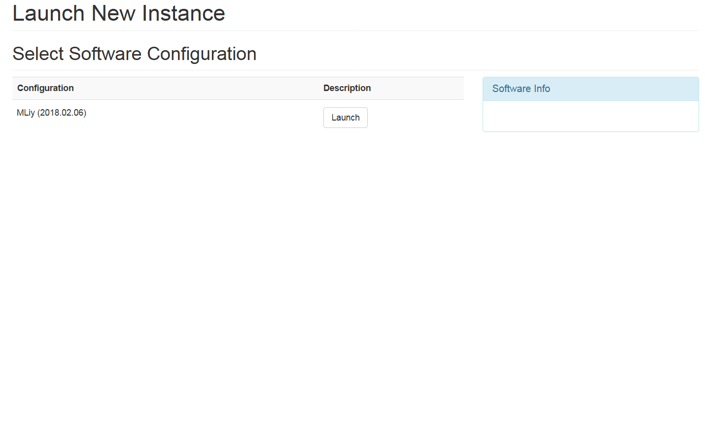
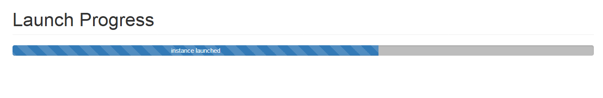

# MLiy User Guide
## MLiy Web Application
The MLiy Web Application allows you to launch and manage MLiy instances and is accessible via the published URL. You will need to logon with your credentials.
### Pre-requisites
- A user account in MLiy Web Application or authorized to login via LDAP/Active Directory Group Membership
- SSH key for the MLiy instance or Membership in a LDAP/Active Directory Group that is authorized to login to the MLiy instance
- Assigned to a preconfigured group in MLiy Web Application
- Firefox or Chrome
### My Dashboard
After you logon to the MLiy Web Application, you will land on your dashboard. Your dashboard lists all the instances you have launched earlier (but not terminated), their instance types, their operational status, their software configuration label, and their uptime if running. Each instances will have an associated web link on the far left and a manage link on the far right. Clicking on the web link will take you to the home page of that instance. Clicking on the manage link will display information about the instance and will allow you to stop, start, reboot or terminate the instance depending on its current state.
### Team Dashboard
Team dashboard (link accessible via the left navigation) lists all instances belonging to members of all the groups you belong to. The columns are the same as in your dashboard except that there is no associated web and manage links. Clicking on the instance ID will display some information about the instance such as owner, software configuration, instance type, state, IP address, stop and start time, last refreshed from AWS, and EBS volume ID.
### Launch New Instance
Click on “Launch New Instance” in the left navigation pane to launch a new MLiy instance. You will be asked to select a group if you belong to multiple groups. You will not see the “Launch Group select” screen if you belong to just one group.

Select the Software Configuration to launch. Your group may be assigned to more than one Software Configurations.

Select the EC2 instance type.

<<<<<<< HEAD
Click on the “Launch Instance” button. You will see the launch progress bar indicating launch status. Depending on the image, instance launch time will vary.
=======
Click on the “Launch Instance” button. You will see the launch progress bar indicating launch status.
>>>>>>> opensource

Once launch is complete, you will automatically be redirected to your dash board.

In your dashboard, you will see the provisioning status of each of the launched instances.

### Manage an Instance
- If you want to manage your instance, click on the “Manage Link” associated with that instance.
- If the instance is stopped, you will see the buttons to start or terminate that instance.
- If the instance is running, you will see the buttons to stop, reboot or terminate instance.

## MLiy EC2 Image
A sample EC2 image for Data Science is included with MLiy. Your administrators may have other images published. User guide for the sample MLiy EC2 image is included in a separate documentation MLiy Image Guide.
