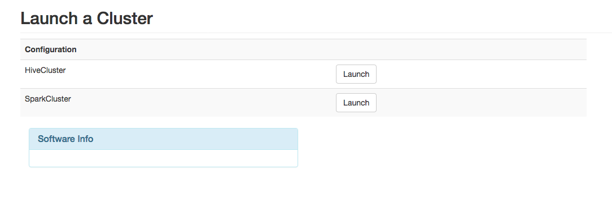
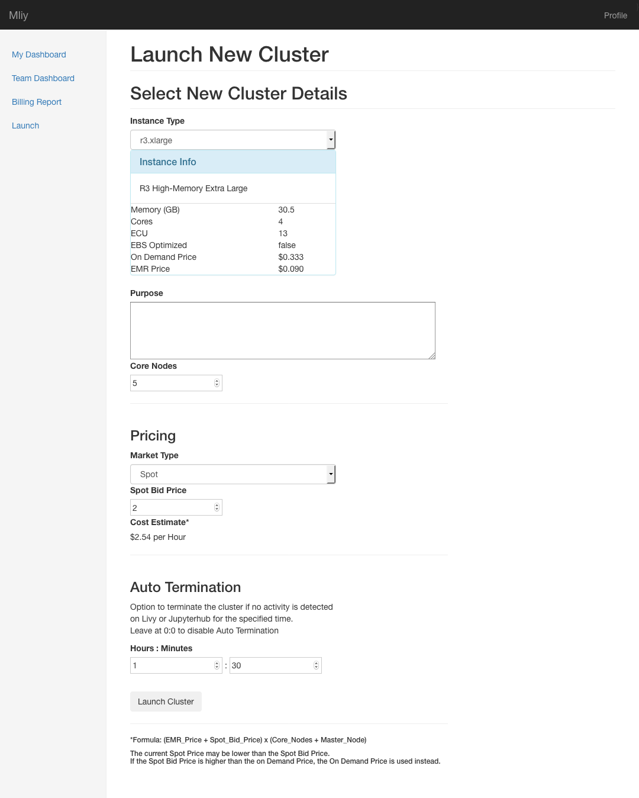
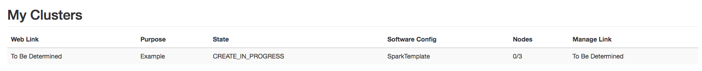

# MLiy User Guide
## MLiy Web Application
The MLiy Web Application allows you to launch and manage MLiy instances and is accessible via the published URL. You will need to logon with your credentials.
### Pre-requisites
- A user account in MLiy Web Application or authorized to login via LDAP/Active Directory Group Membership
- SSH key for the MLiy instance or Membership in a LDAP/Active Directory Group that is authorized to login to the MLiy instance
- Assigned to a preconfigured group in MLiy Web Application
- Firefox or Chrome
### My Dashboard
After you logon to the MLiy Web Application, you will land on your dashboard. Your dashboard lists all the instances you have launched earlier (but not terminated), their instance types, their operational status, their software configuration label, and their uptime if running. Each instances will have an associated web link on the far left and a manage link on the far right. Clicking on the web link will take you to the home page of that instance. Clicking on the manage link will display information about the instance and will allow you to stop, start, reboot or terminate the instance depending on its current state.
### Team Dashboard
Team dashboard (link accessible via the left navigation) lists all instances belonging to members of all the groups you belong to. The columns are the same as in your dashboard except that there is no associated web and manage links. Clicking on the instance ID will display some information about the instance such as owner, software configuration, instance type, state, IP address, stop and start time, last refreshed from AWS, and EBS volume ID.
### Launch New Instance
Click on “Launch” in the left navigation pane to launch a new MLiy instance. You will be asked to select a group if you belong to multiple groups. You will not see the “Launch Group select” screen if you belong to just one group.

Select the Software Configuration to launch. Your group may be assigned to more than one Software Configurations.

Select the EC2 instance type.

Click on the “Launch Instance” button. You will see the launch progress bar indicating launch status. Depending on the image, instance launch time will vary.

Once launch is complete, you will automatically be redirected to your dash board.

In your dashboard, you will see the provisioning status of each of the launched instances.

### Manage an Instance
- To manage your instance, click on the “Manage Link” associated with that instance.
- If the instance is stopped, you will see the buttons to start or terminate that instance.
- If the instance is running, you will see the buttons to stop, reboot or terminate instance.

### MLiy EC2 Image
A sample EC2 image for Data Science is included with MLiy. Your administrators may have other images published. User guide for the sample MLiy EC2 image is included in a separate documentation: [MLiy Image Guide].

### Launch New Cluster

#### Requirements
- The user must be in a Group that allows EMR cluster creation
- EMR Cluster Software Configurations must exist in the databse

Click on “Launch” in the left navigation pane to launch a new MLiy cluster. You will be asked to select a group if you belong to multiple groups. You will not see the “Launch Group select” screen if you belong to just one group.

Select the Software Configuration to launch. Your group may be assigned more than one Software Configuration.

Select the options for your cluster.

|Field|Description|
|---|---|
|Instance Type    | Type of instances you want for your cluster. |
|Purpose          | Purpose of the cluster. This will also become a tag in the Cloudformation stack. |
|Core Nodes       | Number of core nodes to provision for the EMR cluster. |
|Market Type      | Choose between Spot and On-Demand pricing. Choosing On-Demand will disable the Spot Bid Price field. |
|Bid Price        | If On Demand is unchecked, select the bid price for the SPOT instance.|
|Auto Termination | The Hours : Minutes that the cluster needs to be idle before terminating itself. |

Click on the "Launch Cluster" button.

In your dashboard you will see the provisioning status of each of the launched clusters.

### Connecting to a Cluster
Once the cluster starts, the status will eventually change to the WAITING state, at which point the cluster can be accessed. Select the "Manage Link" for more information on the cluster.

Cluster connection methods will vary depending on the applications installed and the cluster's purpose. The example Spark cluster provides a landing web page on the master node's IP address and subsequently Jupyterhub, Spark, and other applications. A Hive cluster on the other hand may connect through a JDBC link.

Custom links (e.g. "jdbc:hive//j-00000000.my_url.org:10000") can be viewed in the "Manage Link" associated with the cluster in the user dashboard in the row "Connection". This can be specified in the Software Config. See [Administrator Guide] on how to set the custom parameter.

### Manage a Cluster
- To manage your cluster, click on the “Manage Link” associated with that cluster in the user dashboard.
- The "Terminate" button on the bottom will terminate the cluster and delete the Cloudformation stack.
- If a cluster fails to go up, or encounters a terminal state, and if it has been in this state for an hour, MLiy will automatically remove the cluster and the Cloudformation stack.

[MLiy Image Guide]:./MLiyImageGuide.md
[Administrator Guide]:./AdministratorGuide.md