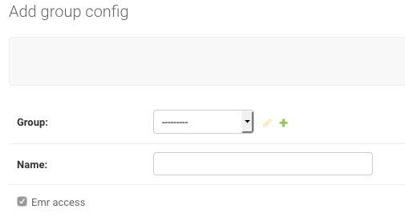

# Giving Users Cluster Access
To give the user access to launching clusters, they must be in a Group that has an associated Group Config with a cluster Software Config.
Group (has a) Group Config (has a) Cluster Software Configuration.

In Software Config: Select Group Config(s) and check the "Emr config" box.

In Group Config: Associate Group with Group Config

Check the box at the top of Group Config to give any users in that Group access to EMR clusters

In Users: Add the user to the Group that has the Cluster Software Config

The user should now have access to launching clusters.