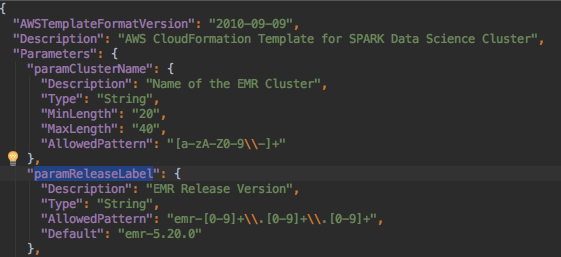
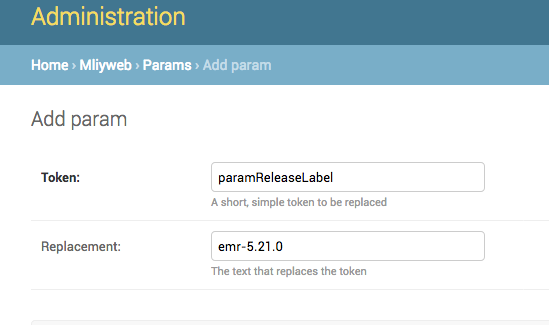
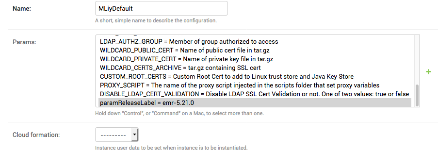

# Cluster Cloudformation Parameters

A set of Cluster Cloudformation parameters are taken from the Django Admin page through Group Config, Software Config, and Params tables. The fields in these provide parameters that can be used in Cloudformation.

There is also an option to provide custom parameters through Software Config and Params tables.

#### Provided Parameters
MLiy provides a set of parameters that gets passed into the Cloudformation template. These are derived from the settings.py in MLiy web application and Software Config and Group Config in the Django Admin console, as well as from user input in the MLiy web application. The Cloudformation template must have the corresponding Parameter Key in order to use these parameters.

Note that these are optional. The Cloudformation template does not have to have all of these parameters. MLiy will not include the parameter if it is not in the Cloudformation template.

###### Parameters set from **settings.py**:
|Parameter Key|Description|Example Parameter Input|
|---|---|---|
|paramTimeZone|Same as the time zone set in the MLiy webapp|US/Eastern (same timezone as MLiy Web)|

###### Parameters set from **Group Config**:

|Parameter Key|Description|Example Parameter Input|
|---|---|---|
|paramEnvironment|Software development environment|DEV|
|paramAGS|Tag for the application|MLIY|
|paramSubnetID|Subnet of the cluster, based on the subnet of the MLiy webapp.|subnet-12345678|
|paramEc2KeyName|Key Pair used to access the master node.|MY_KEYPAIR_ON_EC2|

###### Parameters set from **Software Config**:

|Parameter Key|Description|ExampleParameter Input|
|---|---|---|
|paramInstanceType|Instance type to run the clusters on. For multiple types, use custom Cloudformation templates.|r3.4xlarge|
|paramEMRManagedMasterSecurityGroup|Main security group for the master node.|sg-00000000|
|paramEMRManagedSlaveSecurityGroup|Main security group for the slave nodes.|sg-00000000|
|paramAdditionalMasterSecurityGroups|Additional master security groups. These follow the format of ```List<AWS::EC2::SecurityGroup::Id>```. |sg-00000000,sg-11111111,sg-22222222|
|paramAdditionalSlaveSecurityGroups|Additional slave security groups. These follow the format of ```List<AWS::EC2::SecurityGroup::Id>```. |sg-00000000,sg-11111111,sg-22222222|

###### Parameters set by user input:

|Parameter Key|Description|ExampleParameter Input|
|---|---|---|
|paramMarketType|Market type of the cluster, SPOT or ON_DEMAND.|Checkbox on the MLiy web app. If checked, the value is ON_DEMAND. If unchecked, the value is SPOT.|
|paramCoreInstanceCount|Number of core nodes on the cluster.|Input on the MLiy web app. Numbers will be passed in as Strings into the Cloudformation template.|
|paramTaskInstanceCount|Number of task nodes on the cluster|Input on the MLiy web app. Numbers will be passed in as Strings into the Cloudformation template.|
|paramBidPrice|Bid price for SPOT clusters.|Input on the MLiy web app. Numbers will be passed in as Strings into the Cloudformation template.|

#### Custom Parameters
MLiy provides a way to specify custom parameters for Cluster Cloudformation templates. The application parses the Cloudformation template for Parameters. It then passes in the corresponding values specified in the Software Config's Params.

The following is an example from a sample template provided with MLiy,  AWS_EMR_Spark_MLiy_CloudFormation.json.

1. Get the parameter's name from the Cloudformation template



2. Create a new Param(s)in the Django admin console with the same name as the one in the Cloudformation template and save. Provide the value(s) as needed.



3. Select the Param(s) in the Software Config and save.



4. The parameter will now be included in the input to the Cloudformation template. Note that MLiy will not include the parameter if it is not in the Cloudformation template.

<hr>

MLiy comes with a sample spark cluster that has its own set of parameters alongside the ones listed above. See [Sample Spark Cluster] for more details.

[Sample Spark Cluster]:../sample_aws_resources/sample_spark_cluster.md