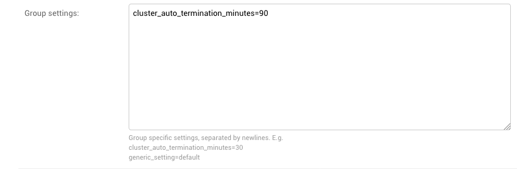

# Group Configs
Use Group Configs to configure Group-specific fields. These include:

- Excluded Instances
- EMR access permissions
- Default Security Groups
- Optional Security Groups
- Cost Center
- PEM Key Name
- IAM Instance Profile
- Launched Instance Name Override
  - Override the generated name of an instance with something specific to the Group
- Group Settings
  - A very flexible field implemented with the intention of extendability
- AD GroupName
  - This feature allows the mapping of AD groups to the Group Config
  - Using this feature will allow the User to be automatically added to a Group as long as their AD matches the AD GroupName and the Group Config is associated with the Group
  - Use the full DN

Click on the Home link on the top left corner and click on Group Configs and add one or more group configuration. Select the group created earlier from the drop down box and give the group configuration a name (usually the same as the group name). If a user is a member of the specified AD group, the user will automatically provisioned to this group and group configuration. Select any instance types to exclude, default security groups to use (in order to limit access to data and services) and optional security groups.

In order to identify EC2 instances launched by this group, provide an instance name.  Provide project name code and charge code and software development tags for AWS resources. Associate SSH keypair and IAM instance profile with this group configuration.

### Setting the Cluster Auto Termination Default
The provided Spark Cluster template has an option to automatically terminate if it is left idle for a specified amount of time. By default this is set to 0 Hours and 0 Minutes, which is equivalent to "auto termination disabled". This can be set through the Group Config by specifying "cluster_auto_termination_minutes=90" in the "Group Settings" field in the Admin Console > Group Configs > (specific Group  Config).
