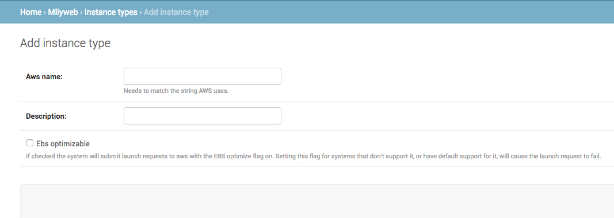

# Instance Types

Click on the Home link on the top left corner and click on Instance Types and add one or more valid EC2 instance types (See allowed values for instance types in scripts/ec2/AWS_EC2_MLiy_CloudFormation).

